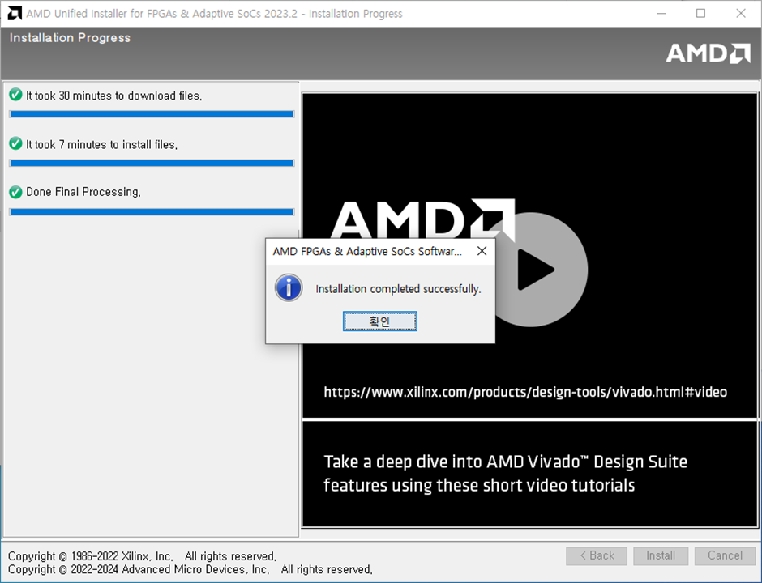

---
sidebar_position:1
---

# Install Vivado tool

## Amd.com 계정 생성

## AMD.com 로그인

## Vivado Download

### 다운로드 페이지

- 다운로드 주소: https://www.xilinx.com/support/download/index.html/content/xilinx/en/downloadNav/vivado-design-tools.html

### 윈도우버전다운로드

- 필요한정보입력후,다운로드

### 다운로드 파일 실행 및 설치

- JDK방화벽예외허용

- 설치화면

- 로그인 정보 입력 후, 다운로드 및 설치 선택

- Vivado 툴 선택

- VivadoML Standard 선택

- 필요한 디바이스 설치 (Artix-7필수)

- 사용동의를전체동의로하고,

- 설치폴더,디스크용량확인

- 설치작업시작

- 다운로드 시작 및 설치 작업 진행

- 케이블소프트웨어설치

- WinPcap설치함께진행

- 설치완료

## 프로그램실행

- 실행

- 실행 화면

