# Program FPGA

실제 Vivado 툴을 이용하여 bit파일을 다운로드 해보자.

## 프로젝트 다운로드

먼저, 프로젝트 파일을 다운로드 한다.  

### Visit GitHub
주소는 다음과 같다.  
> https://github.com/twarelab/apsm1_hdl
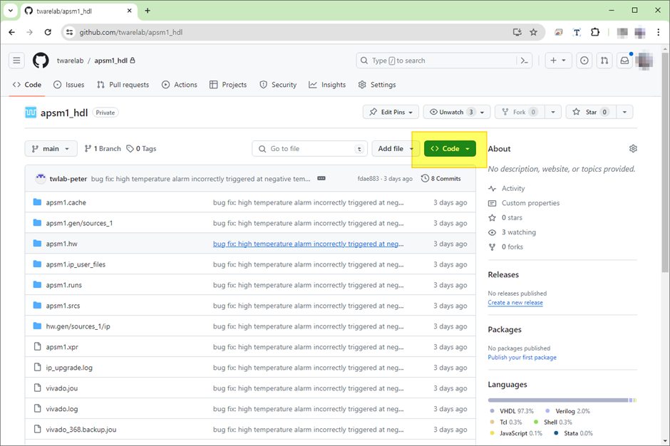

### Download

- “Download ZIP” 선택  
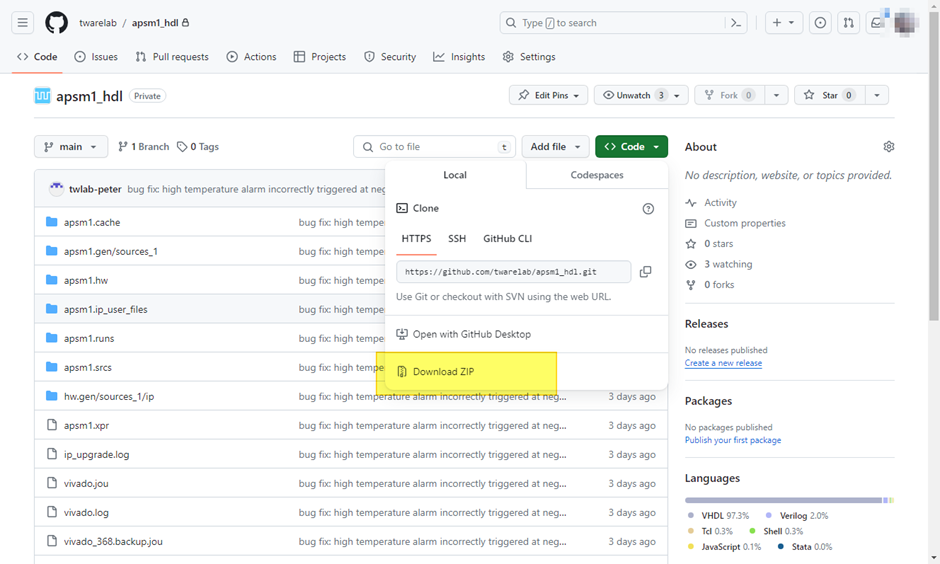

- Save & Extract zip file
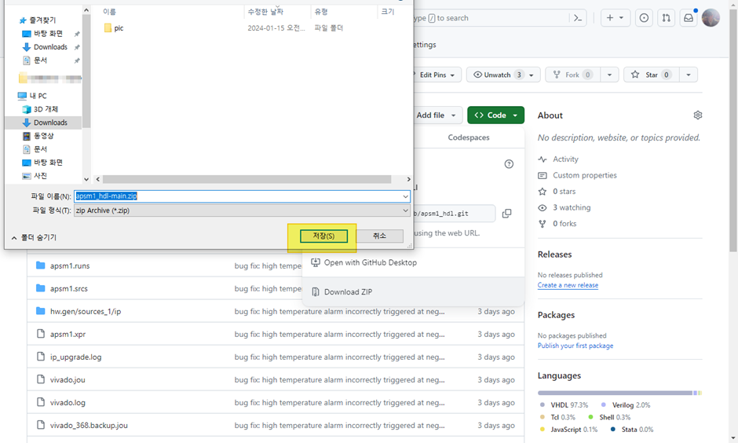

## 프로젝트 열기

- 압축 푼 폴더의 .xpr 파일 더블클릭  
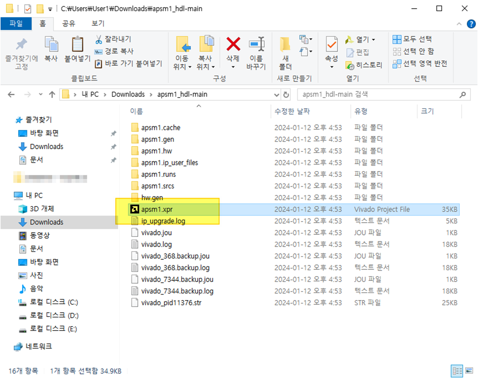

- 로딩 성공
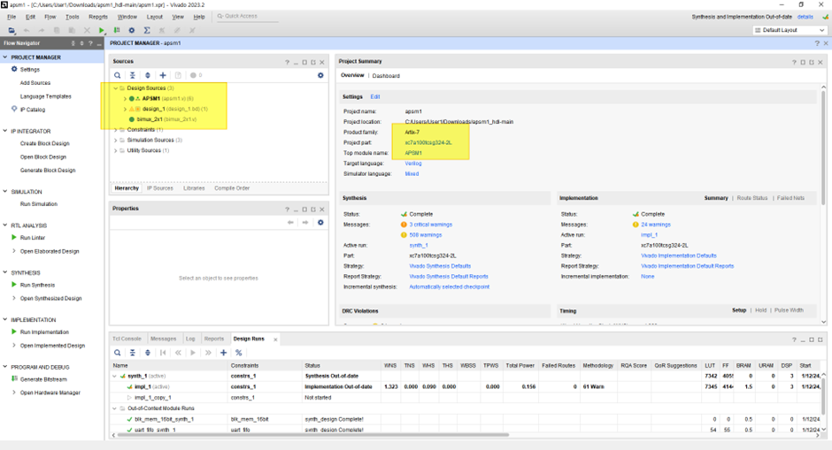

## Program on FPGA

Program and Debug 선택해서 프로그래밍

- Open Hardware Manager
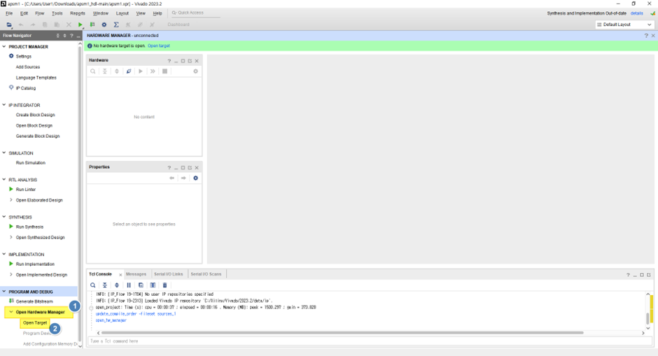
- Open Target
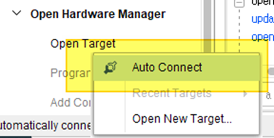

- Connected Target device
  - `xc7a100t_0` 는 FPGA
  - `s25fl128x...` 은 Flash 
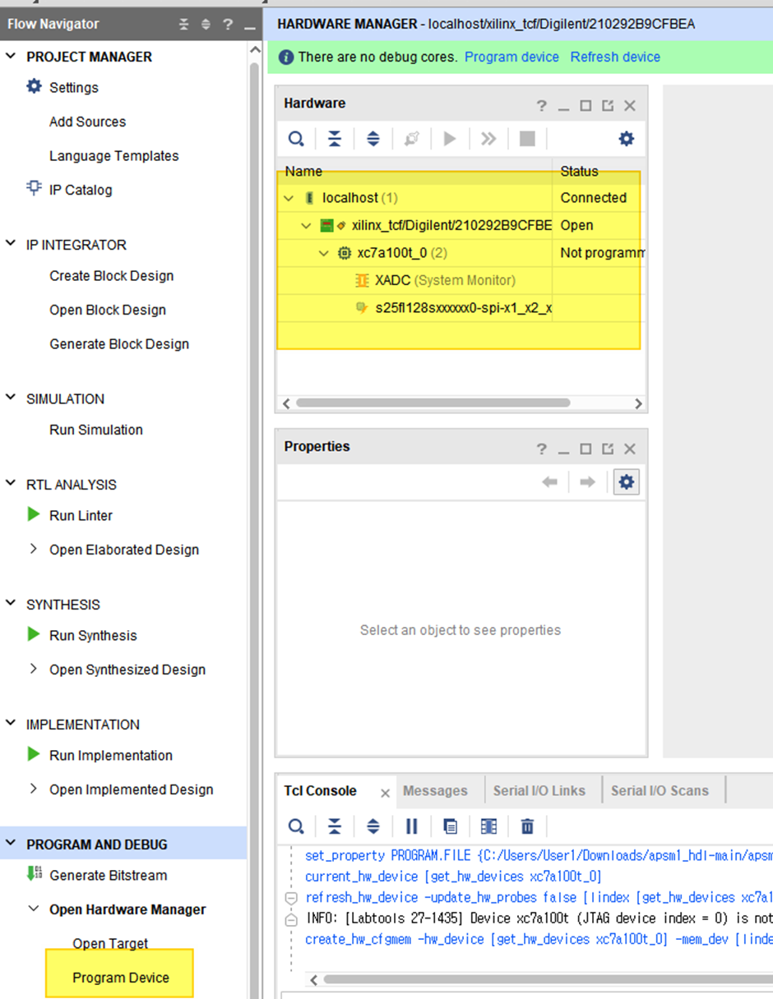

- Program Device 선택
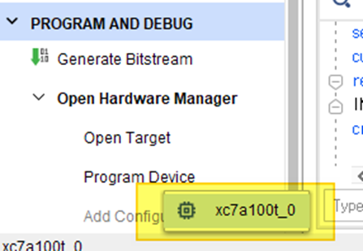
- Select bit or bin file
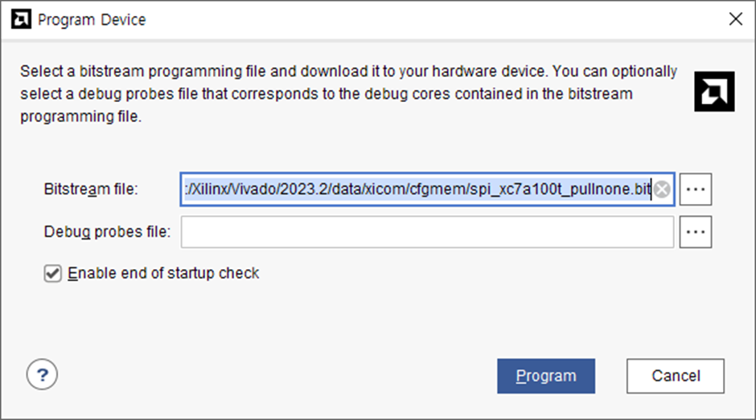
원하는 비트파일을 선택한다. 기본적으로는 아래 폴더에 생성된다.
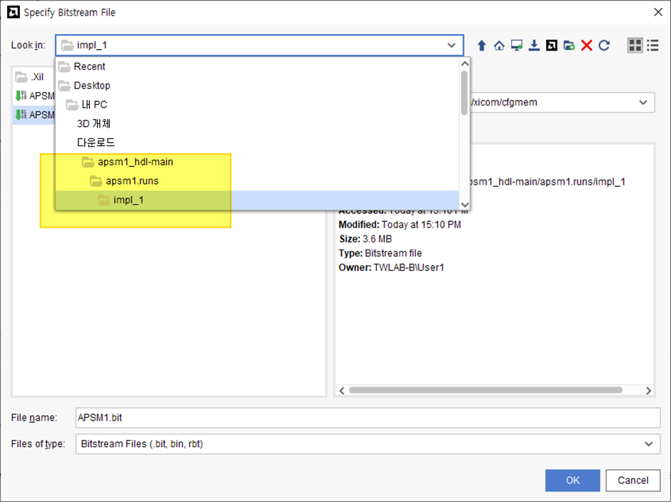

Bit 파일을 선택하고 “OK”버튼을 누른다.
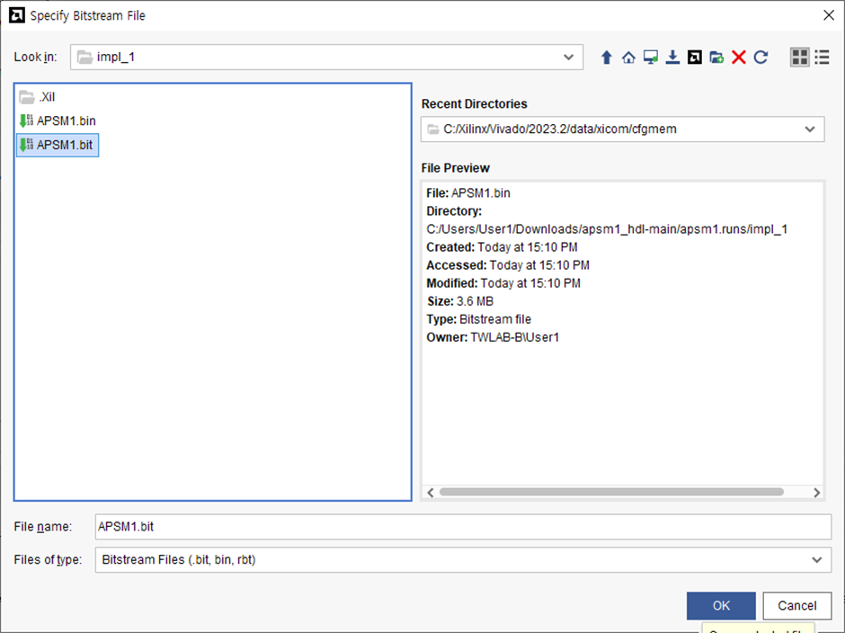

이제 "Program" 버튼을 누르면 끝

## Program on Flash

- Flash 추가
디바이스가 없으면 해당 디바이스를 추가해야 한다.  
먼저 “Add Configuration Memory Device” 메뉴를 선택하면, 해당 FPGA가 나오는 팝업이 뜬다. 선택하고 클릭한다.  
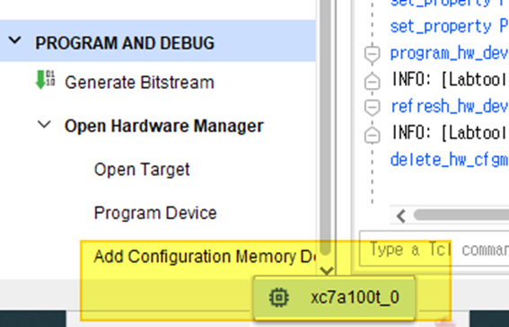
 
해당 Flash를 검색해서 선택해서 추가한다.
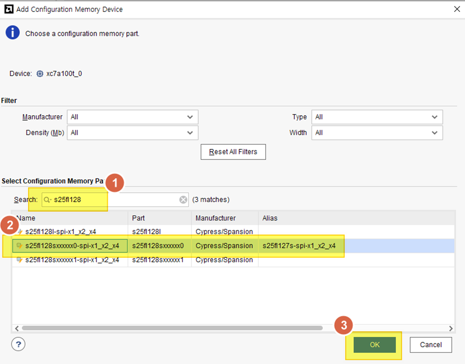

바로 프로그램 할 것인지 묻는 팝업에서 “OK”를 누르면, 바로 프로그램이 가능하다.  
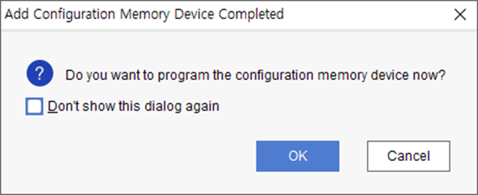

- Flash program
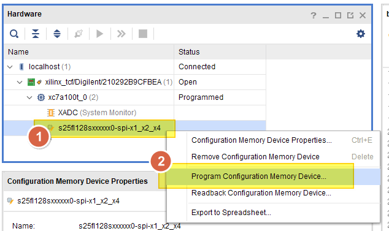

프로그램하는 설정 창은 다음과 같다.
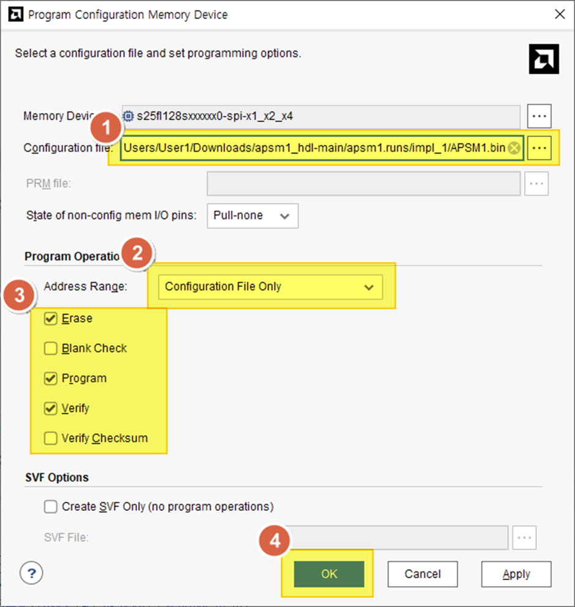

이제 Erase & Program 과정이 수행된다.
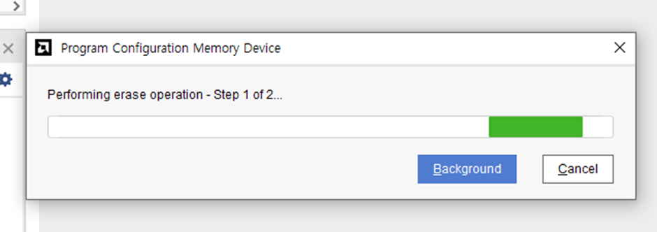
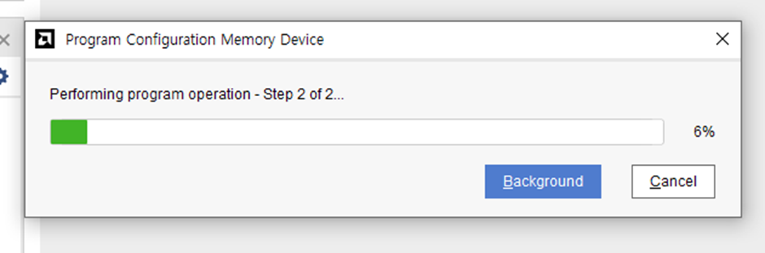

## 완료
모든 작업이 완료되면 다음과 같은 팝업창이 나타난다. "OK" 누르면 완료된다.
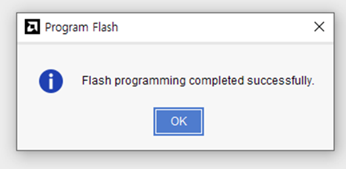
