# Program FPGA bit file

코드로 생성된 bit 파일을 Vivado 툴을 이용하여 다운로드 해보자.  
크게 2가지 방법이 있는데, 전원을 꺼도 데이터가 남아 있게 하려면 Flash 에 프로그래밍 하는 방법을 사용해야 한다.

## 프로젝트 환경 구성
프로젝트 파일을 다운로드 하고, 프로그래밍이 가능한 환경을 먼저 구성해 보자.  

### GitHub 다운로드

프로젝트 소스 코드가 저장된 GitHub 주소는 다음과 같다.  

> https://github.com/twarelab/apsm1_hdl

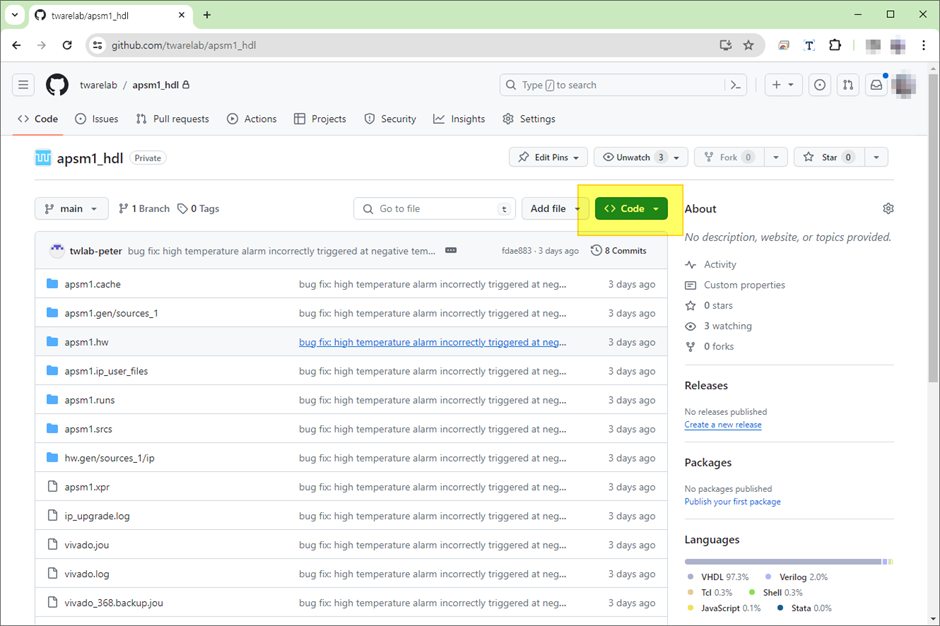

위 그림에 하이라이트 된 "Code" 버튼을 눌러 다운로드를 시작해보자.

### Download

- 메뉴에서 “Download ZIP” 선택을 선택

- Save & Extract zip file - 원하는 위치에 다운로드 파일을 저장한다. 

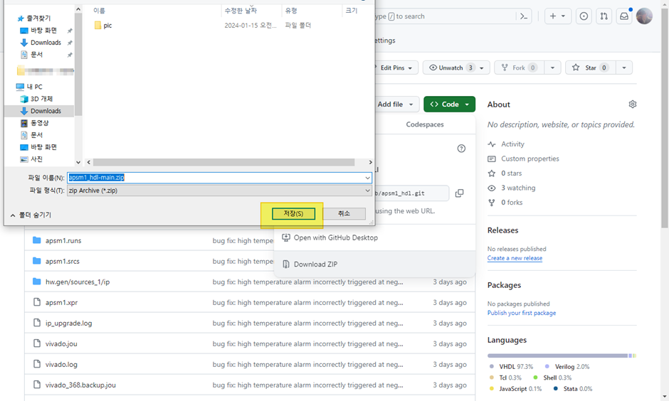

- Zip 압축을 푼다.

이제 프로젝트를 사용할 환경이 완성이 되었다.

## 프로젝트 열기

먼저, 압축 푼 폴더의 .xpr 파일 더블클릭하여 프로젝트를 연다.  
반드시 [Vivado 툴 설치](./install-vivado-tool.md) 파일을 열어서 설치를 정상적으로 한 뒤에 수행한다.

이제, 아래와 같은 화면이 나오면 프로젝트 열기가 성공한 것이다.

## Program on FPGA

Program and Debug 선택해서 bit 파일을 FPGA에 프로그래밍 작업을 수행한다.

먼저, 아래 그림에 하이라이트 된 "Open Hardware Manager" 메뉴를 클릭해서 FPGA 디바이스에 연결 작업을 진행한다.

"Open Target" 메뉴를 클릭하면, 아래와 같이 팝업 메뉴가 나타난다. 
"Auto Connect"를 선택한다.

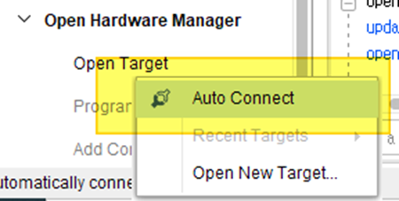

본 과제에 사용한 디바이스 정보는 아래와 같다. 
- Connected Target device
  - `xc7a100t_0` 는 FPGA
  - `s25fl128x...` 은 Flash 

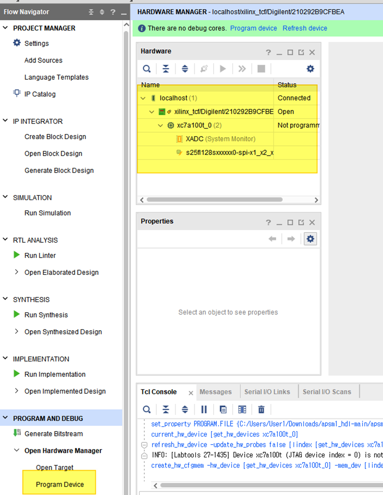

프로그래밍 할 FPGA를 선택한다. "Program Device" 메뉴를 클리하면 아래 그림처럼 팝업메뉴로 선택할 수 있다.

프로그래밍 하는 다이얼로그 박스가 나타난다. 

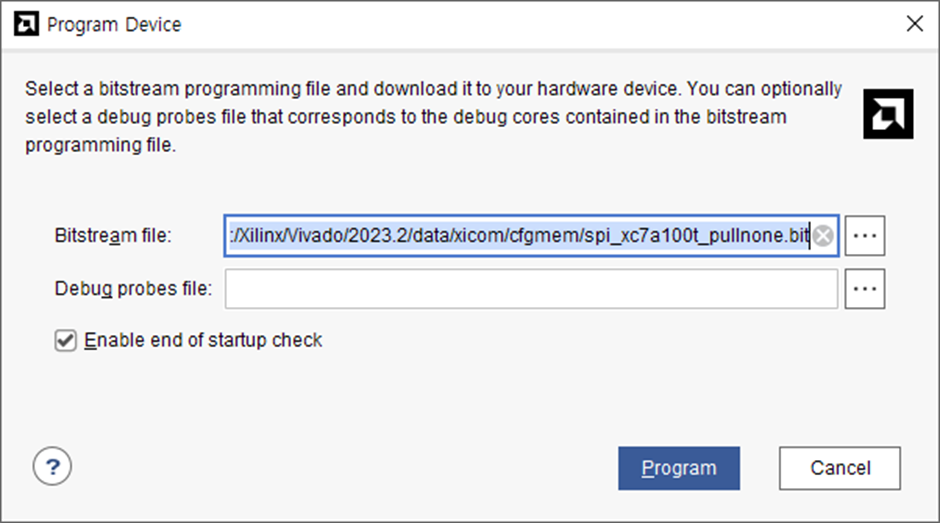

우선 원하는 bit 파일을 선택해야 한다. 
프로젝트에서는 bit 파일은 아래 폴더에 저장되어 있다. 

이제 해당 bit 파일을 선택하고 “OK”버튼을 누르고, "Program" 버튼을 누르면 FPGA에 프로그램이 완료된다. 

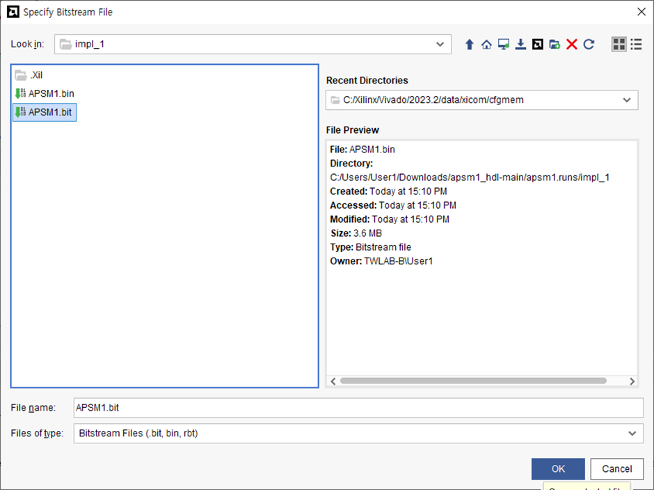

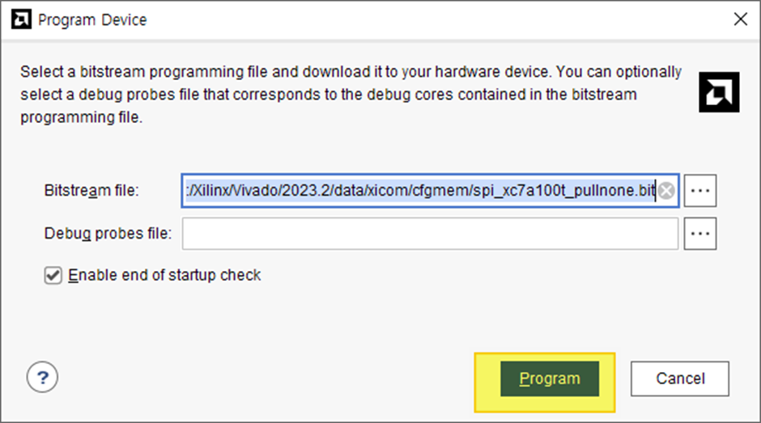

## Program on Flash
전원이 꺼지면, 위의 방법으로 한 bit 파일은 FPGA에서 사라져서 다시 전원이 들어와도 동작하지 않는다. 따라서, Flash에 bit 파일을 프로그래밍 해야 한다.

### Flash 장치 추가
우선 Flash 디바이스를 추가해야 한다. 만약 선택된 디바이스가 있으면 이 과정은 넘어가도 된다.  

“Add Configuration Memory Device” 메뉴를 선택하면, 해당 FPGA가 나오는 팝업이 뜬다. 
선택하고 클릭한다.  

 
본 과제에 사용된 Flash를 검색해서 선택해서 추가한다.

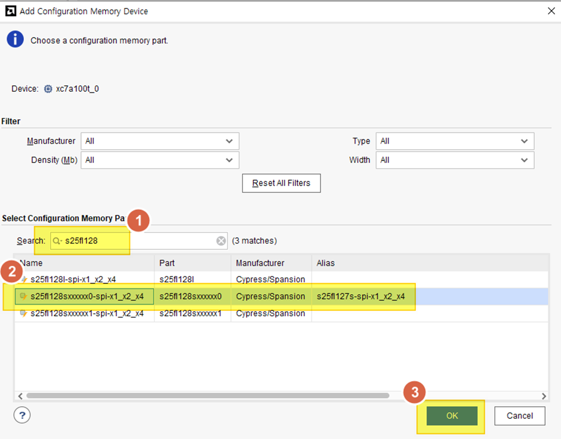

추가가 되면, 바로 프로그램 할 것인지 묻는 팝업에서 “OK”를 누르면, 바로 프로그램이 가능하다.  

이제 Flash에 프로그래밍을 해보자.

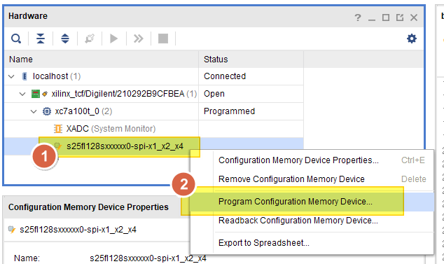

프로그램하는 방법은 아래 그림 순서대로 보고 따라하면 된다.

이제 Erase & Program 과정이 수행된다.

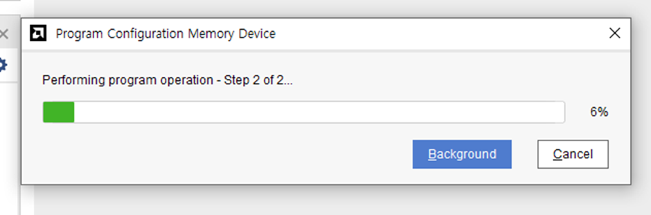

## 완료
모든 작업이 완료되면 다음과 같은 팝업창이 나타난다. 
"OK" 누르면 완료된다.

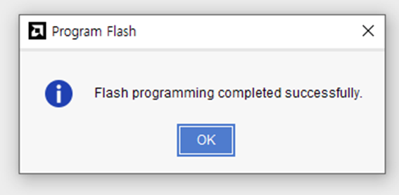

