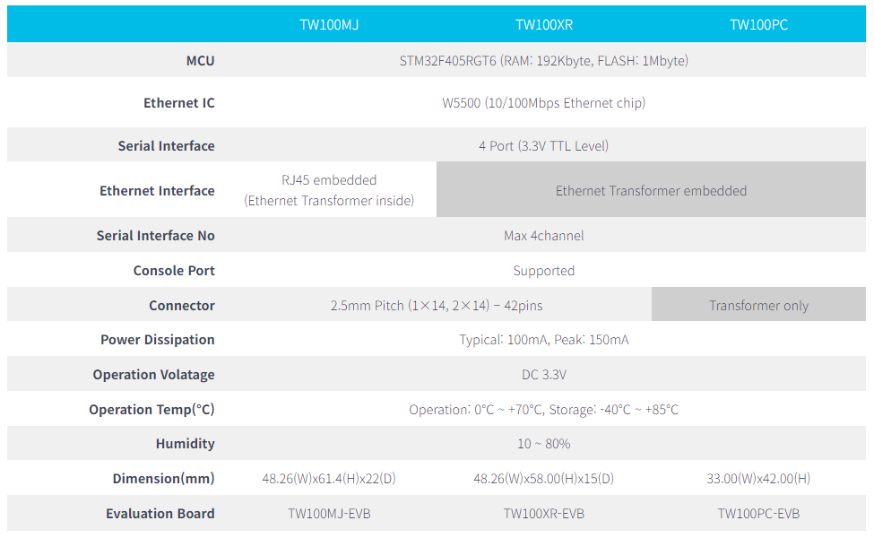

# TW100 Series Overview

티웨어랩의 TW100 Series는 프로토콜 변환기 역할을 하는 임베디드 모듈입니다.
시리얼 장비가 보낸 데이터를 TCP/IP 데이터로 변환시켜 네트워크로 전송시키는 역할과 네트워크를 통해 받은 TCP/IP 데이터를 시리얼 데이터로 전환시킨 후 전송하는 역할을 합니다.

## 제품 사양

## Main features

- Support 4 serial ports simultaneously
- Easy to connect to TCP/IP Internet network
  - Add a Internet fucntions into legacy serial device
  - Support firmware customizing
- High stable and reliability with full hardware Ethernet chipset
- Easy config with Configuration Tool Program
- Supports “Serial Command” set for Serial Configration
- Supports Static IP, DHCP setting
- Includes DNS function

## Documents
### PDF Version
- [TW100XX Datasheet – V1.2](pdf/TW100xx%20Datasheet-Rev1.2.pdf)
- [TW100XX User Manual V1.0 - English](pdf/TW100xx%20User%20Manual_Rev1.0.eng.pdf)
- [TW100XX User Manual V1.0 - Korean](pdf/TW100xx%20User%20Manual-Rev1.0.pdf)
- [TW100XX Configuration Tool Manual V1.0 - English](pdf/TW100xx_Configuraion_Tool_Manual-Rev1.0.eng.pdf)
- [TW100XX Configuration Tool Manual V1.0 - Korean](pdf/TW100xx_Configuraion_Tool_Manual-Rev1.0.pdf)

### Web Version
- [TW100xx Datasheet](tw100xx-datasheet.md)
- [TW100xx User Manual](./tw100xx-user-manual.md)
- [TW100xx Configuration Tool Manual ](./tw100xx-configuration-tool-manual.md)

### Tutorials
- [TW100xx EVB Getting Started](Tutorials/TW100xx-EVB-Getting-Started.md)
- [S2E Test Tool Tutorial](Tutorials/s2e-testtool-tutorial.md)

## Download

TW100xx 모듈의 최종 바이너리 파일이나 Configuration Tool을 포함한 각종 Tool을 다운로드 받을 수 있다.

[Download Page](download.mdS)
