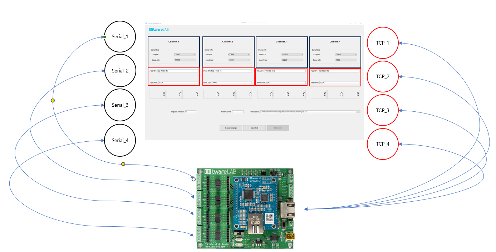
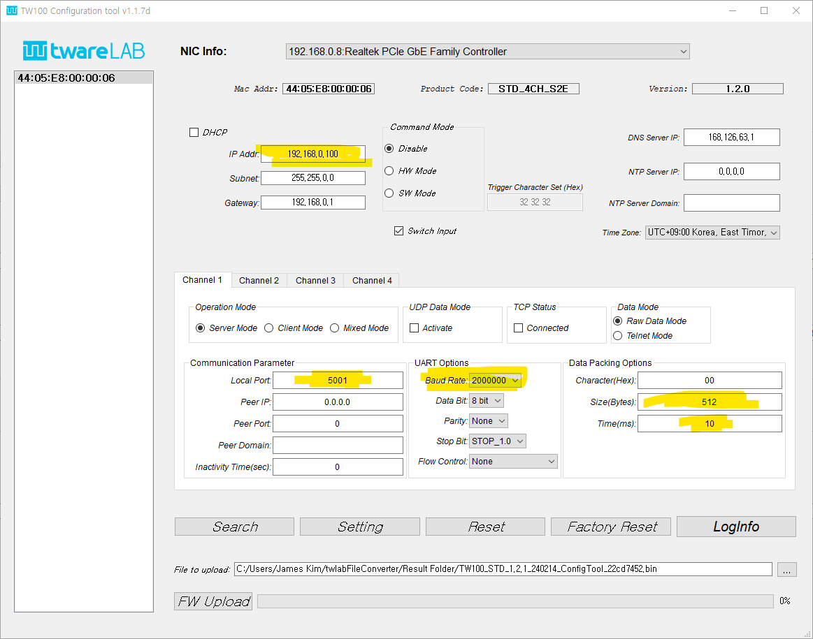
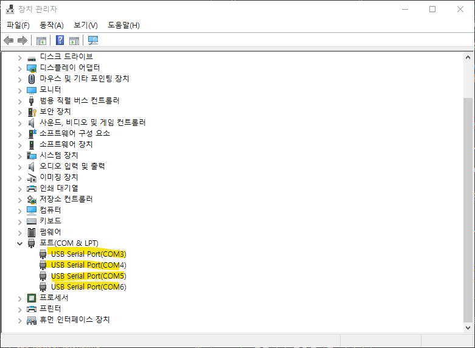
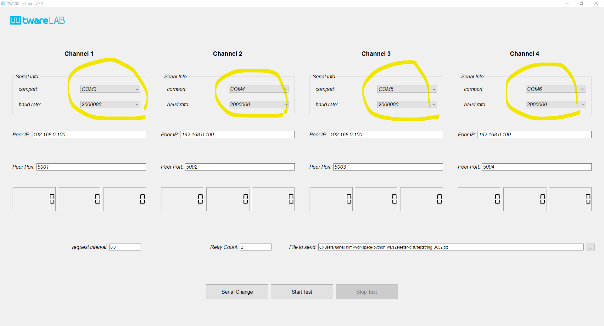
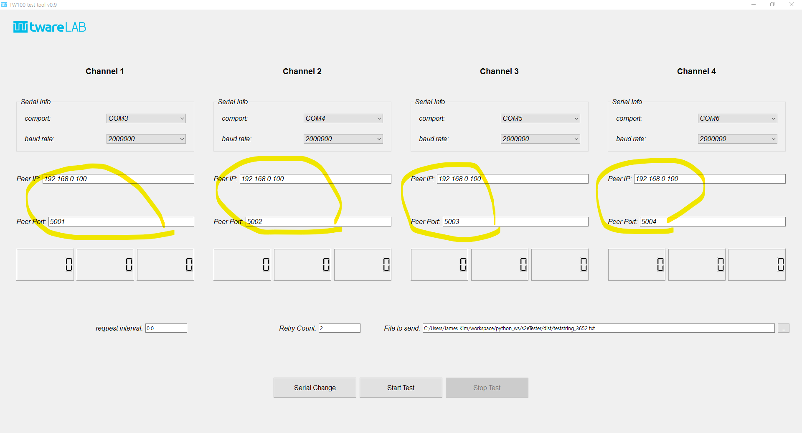

# S2E Test Tool Tutorial

티웨어랩의 멀티채널 Serial-to-Ethernet 모듈의 기능 검증용 소프트웨어 사용법을 소개한다.

## S2E Test Tool 
### 개요 

TW100xx 시리즈의 모듈은 기본적으로 Serial 4채널과 Ethernet 기반 TCP/UDP Socket 4개간의 데이터 교환을 제공한다.
따라서 모듈의 기능을 Fully 테스트 하기 위해서는 모듈과 통신하기 위한 4개의 Serial Task와 4개의 Ethernet Socket Task를 처리하는 소프트웨어 툴이 필요하다.

다양한 업체에서 제공되는 상용 툴을 이용할 수 도 있지만 TW100xx 시리즈 모듈 검중용으로 전용 소프트웨어가 필요해서 고객용으로 제공한다.

## 동작 시나리오

- S2E Test Tool은 지정된 Peer IP 주소와 Port 번호로 접속을 한 후, 접속이 되면 데이터 요청 메시지를 전송한다. 여기서는 "?\r\n"를 전송한다.
이 데이터는 TW100xx의 TCP Socket으로 전달되고 해당 데이터는 시리얼 포트를 통해서 모듈에 연결된 시리얼 장치(USB-to-Serial 동글)로 전달된다.

- S2E Test Tool의 Serial Task는 "?\r\n" 데이터를 수신하면 지정된 파일내의 데이터를 읽어서 시리얼로 전달한다.

- TW100xx 모듈은 시리얼 포트에서 입력된 데이터를 연결된 TCP Socket을 거쳐서 요청한 S2E Test Tool의 해당 포트로 전달한다.

- S2E Test Tool의 해당 포트는 일정 시간내에 수신된 데이터가 지정된 파일의 내용과 동일하면 성공으로 판단하고 데이터가 깨졌거나 일정 시간이 경과할 때까지 전체 데이터가 수신되지 않으면 에러로 처리한다.

## 테스트 수행 
### 시스템 구성도

테스트 환경은 아래 그림과 같이 구성한다.

Test Tool에게 시리얼 포트를 제공하기 위해서는 USB-to-Serial 동글이 필요하다.
4개의 Serial 포트가 필요하기 때문에 1 포트 동글 4개 또는 4개 시리얼 포트를 제공하는 모듈이 필요하다.

### TW100xx 모듈 설정
먼저 twareLAB Config Tool을 이용해서 테스트할 모듈에 대한 설정을 수행한다.
이때 중요한 내용은 다음과 같다.
1. 각 Serial Port의 Baud Rate, Flow Control 등 시리얼 설정
2. TCP Socket 연결을 위한 장치의 IP 주소와 각 채널별 Port 번호
3. 시리얼에서 전송하는 데이터 사이즈가 큰 경우, 데이터 패킹 옵션 설정

#### Serial Port 설정값
Baud Rate는 2M bps로 지정하고, 나머지는 Default 값으로 둔다.

#### TCP Socket 설정값
Channel 1번부터 Port 번호는 5001 ~ 5004를 지정한다.

#### 데이터 패킹 옵션
Size Option은 512(bytes), Time Option은 10(ms)를 지정한다.
이것은 시리얼에서 올라오는 데이터가 512 바이트 되면 그 단위로 이더넷 패킷을 만들어서 Peer 장치로 전송한다는 의미이며, 512 바이트가 수신되지 않았더라도 시리얼 수신이 10ms 동안 없으면 그때까지 수신된 데이터를 하나의 패킷으로 만들어서 전송한다는 의미이다.

### Serial Port 설정
USB-to-Serial 동글이 PC에서 어떤 Comport 장치로 인식되었는 지를 확인해서 해당 포트를 열어주어야 한다.

Comport가 어떻게 인식되었는지는 "장치관리자"에서 확인할 수 있다.

S2E Test Tool에서 시리얼 설정 지정은 다음과 같이 한다.

### TCP Port 설정
twareLAB Config Tool에서 설정한 장치의 IP 주소와 각 포트 넘버를 이용해서 접속 정보를 지정한다.
여기서 장치의 IP는 "192.168.0.100"이고 포트 넘버는 채널 1번부터 5001 ~ 5004가 된다.

