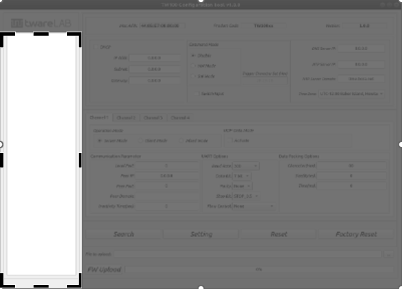
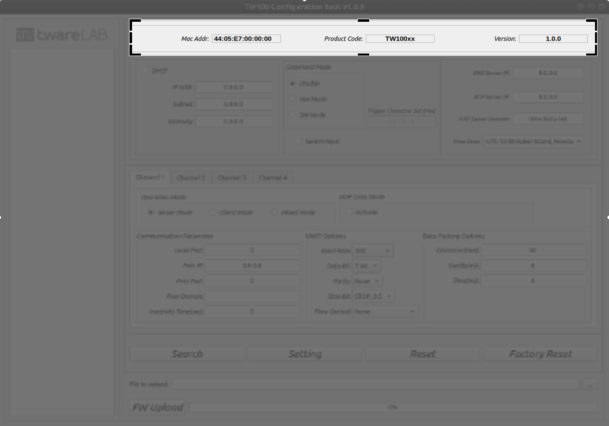
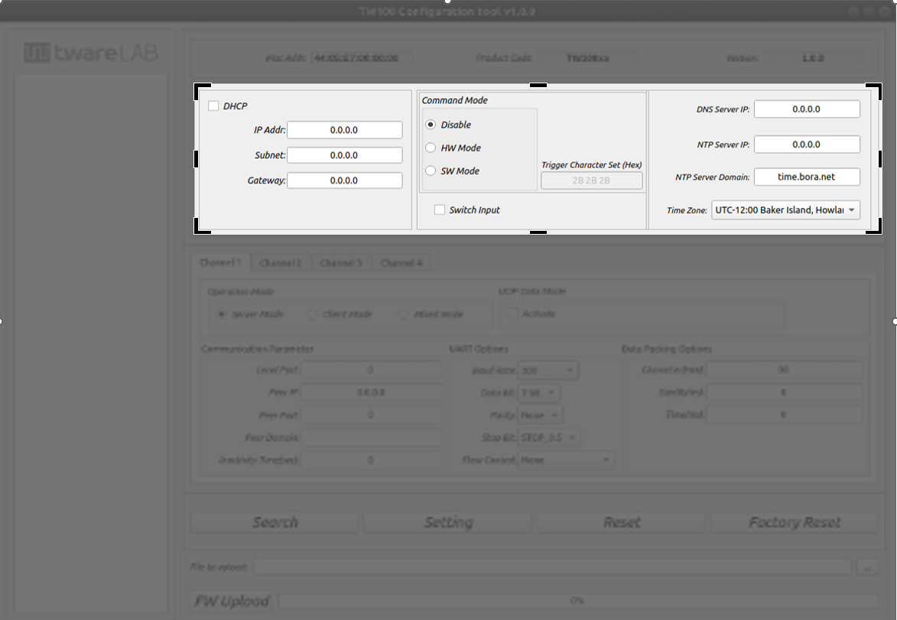
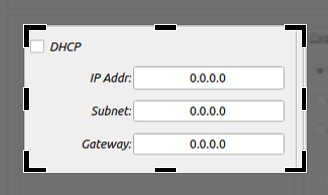
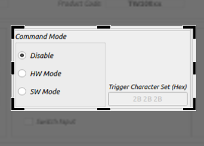

# twareLAB Configuration Tool

이 문서는 TW100xx 시리즈 제품을 설정하기 위한 설정툴의 사용법을 제공합니다.
본 문서에서 설명하는 설정툴은 TW100xx 시리즈 제품을 포함해서 twareLAB에서 제공되는 모든 제품에 공통적으로 사용할 수 있는 툴입니다.

## Configuration Tool Window
twareLAB 표준 Configuration Tool은 twareLAB에서 공급하는 모듈을 설정하기 위해서 사용하는 PC Application이다. Windows용과 Linux용 두 가지 버전이 있으며 Freeware로 제공한다. 아래 그림은 Configuration Tool을 실행했으면 표시되는 초기 화면의 모습이다.

### Device List Section
검색된 보드들의 MAC 리스트가 나타나는 영역이다. 이 곳의 MAC Address를 하나 선택하면, 최초에 한 번 보드의 정보를 가져오게 된다.

“Search” 버튼을 눌러, 보드가 네트워크에서 검색이 되면 “Device List Section”에 보드 리스트가 나타난다.

### Device Basic Info Section
선택된 보드의 기본적인 정보 (Mac Address, Product code, Firmware version)를 표시하는 부분이다. Product Code는 Product Name으로 변환되어서 표시된다.

검색된 보드 중 하나를 선택하면, 선택된 보드의 기본 정보를 보여준다.

### Device General Info Section
IP Address를 포함한 TCP/IP 네트워크 정보와, 명령모드, 진입 키워드, NTP 서버 정보를 보여주는 영역이다.

아래와 같이 3부분으로 구성되어 있다.

#### Device Network Info Part
TCP/IP 통신을 위한 기본 정보인 IP Address, Subnet, Gateway IP address 정보를 보여준다. 수동 설정이 아닌 자동으로 IP Address를 받아오는 DHCP 옵션을 제공한다.

#### Serial Command Mode Setting Part
시리얼 터미널로 보드를 제어하는 “Serial Command Mode” 세팅을 위한 영역이다.

“Command Mode”는 다음과 같은 3가지 옵션을 제공하고 있다.
| 옵션  | 상세내용 |
|:-----:|:---------------|
|Disable| Serial Command Mode를 사용하지 않는다는 옵션 |
|HW Mode| HW_TRIGGER Pin의 상태값에 따라서 Serial Command Mode를 Enable/Disable할 수 있는 옵션.|
|SW Mode| UART1번 포트로 미리 약속된 Character Set을 연속적으로 전송하면 Serial Command Mode로 진입하는 옵션. 
펌웨어 버전 1.0.0에서는 지원하지 않는다. |

#### Switch Input Setting Part
#### Option Setting Part
### Device Channel Info Section
#### Operation Mode Part
#### Connection Parameter Part
#### UART Setting Info Part
#### Data Packing Option Part
### Command Button Section
### Firmware Upload Section
#### Upload File Section Part
#### Upload Start and Progress Part
## Fuctions
### Device Search
### Device Setting
### Device Reset
### Device Factory Reset
### Firmware Update