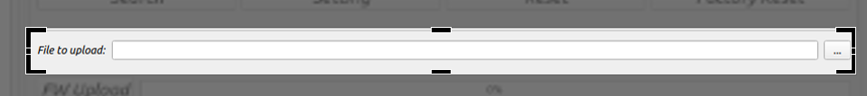

# twareLAB Configuration Tool

이 문서는 TW100xx 시리즈 제품을 설정하기 위한 설정툴의 사용법을 제공합니다.
본 문서에서 설명하는 설정툴은 TW100xx 시리즈 제품을 포함해서 twareLAB에서 제공되는 모든 제품에 공통적으로 사용할 수 있는 툴입니다.

## Configuration Tool Window
twareLAB 표준 Configuration Tool은 twareLAB에서 공급하는 모듈을 설정하기 위해서 사용하는 PC Application이다. Windows용과 Linux용 두 가지 버전이 있으며 Freeware로 제공한다. 아래 그림은 Configuration Tool을 실행했으면 표시되는 초기 화면의 모습이다.

### Device List Section
검색된 보드들의 MAC 리스트가 나타나는 영역이다. 이 곳의 MAC Address를 하나 선택하면, 최초에 한 번 보드의 정보를 가져오게 된다.

“Search” 버튼을 눌러, 보드가 네트워크에서 검색이 되면 “Device List Section”에 보드 리스트가 나타난다.

### Device Basic Info Section
선택된 보드의 기본적인 정보 (Mac Address, Product code, Firmware version)를 표시하는 부분이다. Product Code는 Product Name으로 변환되어서 표시된다.

검색된 보드 중 하나를 선택하면, 선택된 보드의 기본 정보를 보여준다.

### Device General Info Section
IP Address를 포함한 TCP/IP 네트워크 정보와, 명령모드, 진입 키워드, NTP 서버 정보를 보여주는 영역이다.

아래와 같이 3부분으로 구성되어 있다.

#### Device Network Info Part
TCP/IP 통신을 위한 기본 정보인 IP Address, Subnet, Gateway IP address 정보를 보여준다. 수동 설정이 아닌 자동으로 IP Address를 받아오는 DHCP 옵션을 제공한다.

#### Serial Command Mode Setting Part
시리얼 터미널로 보드를 제어하는 “Serial Command Mode” 세팅을 위한 영역이다.

“Command Mode”는 다음과 같은 3가지 옵션을 제공하고 있다.
| 옵션  | 상세내용 |
|:-----:|:---------------|
|Disable| Serial Command Mode를 사용하지 않는다는 옵션 |
|HW Mode| HW_TRIGGER Pin의 상태값에 따라서 Serial Command Mode를 Enable/Disable할 수 있는 옵션.|
|SW Mode| UART1번 포트로 미리 약속된 Character Set을 연속적으로 전송하면 Serial Command Mode로 진입하는 옵션. 펌웨어 버전 1.0.0에서는 지원하지 않는다. |

#### Switch Input Setting Part
TW100xx 모듈은 외부 GPIO 입력에 의해서 Software Reset, Factory Reset을 할 수 있는 기능을 제공하며 이것을 Switch Input이라고 한다.

| 상태  | 의미 | 상세내용 |
|:-----:|:-----:|:----------|
|Checked| Enable | SW_Input 핀 감시 기능을 구동한다. |
|Unchecked| Disable | SW_Input 핀 감시를 하지 않는다. |

#### Option Setting Part
도메인 네임으로 접속이 가능하게 해주는 기능을 위한 DNS Server IP 설정, 시간 정보를 받아오기 위한 NTP Server 정보를 설정하는 영역이다

NTP를 사용하는 경우, Time Zone을 통해 자신의 지역에 있는 로컬타임 설정을 가능하게 한다.

### Device Channel Info Section
TW100XX 보드는 최대 네 개의 시리얼 인터페이스를 지원한다. 각 시리얼 인터페이스의 설정을 위한 영역이다.

아래와 같이 크게 네가지 영역으로 구분된다.

#### Operation Mode Part
통신 동작 모드의 설정을 위한 영역이다. 지원되는 형태는 크게 TCP 통신 연결을 사용하는 모드와 비연결성 UDP 통신 연결을 이용하는 UDP 모드가 있고 TCP 모드의 경우는 “Server Mode”, “Client Mode”, “Mixed Mode” 세가지를 지원한다.

“Operation Mode”의 상세 설명은 “TW100xx User Manual”을 참조하라.

#### Connection Parameter Part
Operation Mode Part에서 사용되는 TCP/IP 데이터 통신을 위한 기본 정보를 관리하는 영역이다.

아래와 같이 세부적인 의미를 가진다.

- Local Port: TW100XX의 Local port 정보로 기본적인 TCP Socket의 Local port 로 사용된다. 단, “Server Mode”에서 Listen Port로 접속을 위한 중요한 정보로 사용된다.
- Peer IP: 상대방의 IP 주소이다.
- Peer Port: 상대방의 통신 포트넘버이다.
- Peer Domain: 상대방의 주소가 IP 주소 대신 도메인명인 경우 그 값을 지정하는 필드이다.
- Inactivity Time: 데이터 통신 중에 데이터의 교환이 지정된 시간 동안 발생하지 않으면, 연결된 TCP Connection을 자동으로 끊어버리는 기능이다. 장시간 데이터 통신이 없는 TCP Connection을 유지하는 네트워크의 부담을 줄여주고, 예상치 않은 네트워크의 장애를 짧은 시간에 발견하는 데 도움을 주는 기능이다.

#### UART Setting Info Part
시리얼 인터페이스 통신을 위한 기본적인 정보를 설정하는 영역이다.

#### Data Packing Option Part
시리얼 데이터를 TCP/IP 네트워크로 전송할 때, 실시간으로 바로 보내는 것이 기본적인 방식이지만, 특정한 조건을 만족할 때만 데이터를 모아서 보내고 싶은 경우 사용되는 Data Packing Options을 지정하는 영역이다. Data Packing Options 동작에 대한 상세 설명은 “TW100xx User Manual”을 참조하라.

지원되는 조건은 아래 3가지로 구분된다. 2가지 이상이 지정되는 경우, 하나라도 만족하면 데이터 전송이 수행된다.

| 옵션  | 상세내용 |
|:-----:|:---------------|
|Character(Hex)| 1Byte 문자의 Hex Code를 표시한다. 비활성화하려면 “00”을 입력한다. |
|Size(Bytes)| Size를 0 ~ 1000 사이의 숫자를 입력한다. 비활성화하려면 “0”을 입력한다. |
|Time(ms)| Time을 0 ~ 1000 사이의 숫자를 입력한다. 비활성화하려면 “0”을 입력한다. |

### Command Button Section
보드를 검색하거나, 세팅, 리셋 하는 기능을 수행하는 버튼들이 있는 영역이다.

| 옵션  | 상세내용 |
|:-----:|:---------------|
|Search| 동일 네트워크에 있는 TX100xx 보드들을 검색하는 기능 |
|Setting| 선택된 보드에 현재 프로그램에 설정된 값을 적용하는 기능 |
|Reset| 선택된 보드를 Software Reset하는 기능 |
|Factory Reset| 선택된 보드를 “공장초기화”하고 Reset 하는 기능 |

자세한 내용은 Functions부분을 참고하라

### Firmware Upload Section
펌웨어 업데이트를 위한 정보를 설정하는 영역이다.

아래와 같이 2가지 부분으로 나누어져 있다.

#### Upload File Section Part
업데이트할 펌웨어 파일 선택하는 영역이다.   버튼을 눌러 원하는 펌웨어 파일을 선택하면 된다. 실행파일 폴더내에 있는 binary 라는 폴더가 초기 값으로 지정되어 있다.

#### Upload Start and Progress Part
“FW Upload” 버튼과 업데이트 진행 상태를 나타내는 영역이다.

자세한 기능 동작은 Functions 부분을 참고하라.

## Fuctions
디바이스 검색, 설정, 리셋, 펌웨어 업데이트 크게 4가지 기능을 지원한다.

### Device Search
현재 네트워크 상에 동작하고 있는 TW100XX 보드를 검색해서 보여준다. “Search” 버튼을 누르면 검색 작업을 시작하게 된다.

위 그림처럼, 검색된 보드들의 MAC Address 가 “Device List” 영역에 표시된다. 표시된 보드의 MAC Address를 누르면, 최초 한번은 보드의 정보를 가져오기 위한 작업 시간이 소요된다. 정보 수신이 완료되면 정보창에 수신한 보드 정보를 자동으로 업데이트 해서 보여준다.

### Device Setting
선택된 TW100XX 보드의 정보를 설정하는 기능이다. 

선택된 보드의 정보를 수정한 이후에, “Setting” 버튼을 누르면 설정 작업을 수행하게 된다. 작업이 정상으로 완료되면, 아래와 같은 메시지 창이 나타난다.

### Device Reset
선택된 보드를 강제 리셋 하는 기능이다.

보드를 선택하고 “Reset” 버튼을 누르면 강제 리셋을 수행한다. 해당 보드에서 리셋 메시지를 받으면 다음과 같은 메시지 창이 표시된다.

### Device Factory Reset
선택된 보드를 Factory Reset 하는 기능이다. 보드 동작이 이상하거나, 설정을 잘못한 경우, 출시 초기 상태로 돌려주는 기능이다.

보드를 선택하고, “Factory Reset” 버튼을 누르면 해당 보드의 Factory Reset을 수행하게 된다. 지금까지의 설정 값이 없어지고, 출시 초기값으로 변경되므로, 주의해서 기능을 사용해야 한다. “Factory Reset” 메시지를 보드에서 정상적으로 수신하면 다음과 같은 메시지 창이 표시된다.

### Firmware Update
TW100XX 보드의 펌웨어를 이더넷을 통해서 업데이트 할 수 있는 기능이다.

보드를 선택하고, 펌웨어 파일을 선택한다.
“File to upload” 영역에서 “…” 버튼을 누르면 다음과 같은 파일 선택창이 나타난다. 원하는 펌웨어 파일을 선택하고 “Open”버튼을 누른다.

파일 명을 확인하고, 아래에 있는 “File Upload” 버튼을 누르면 바로 펌웨어 업데이트 기능이 수행된다. 