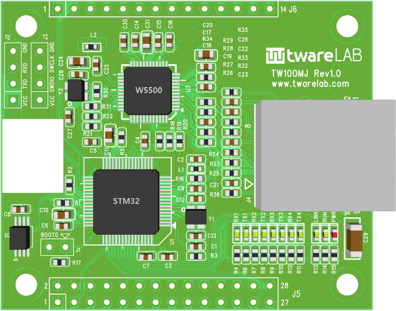
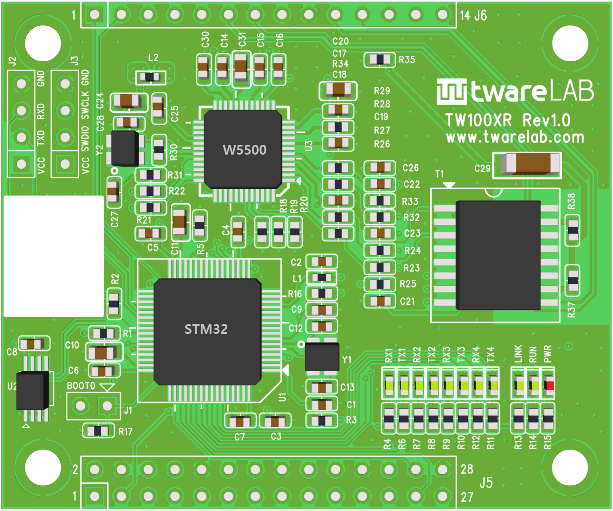
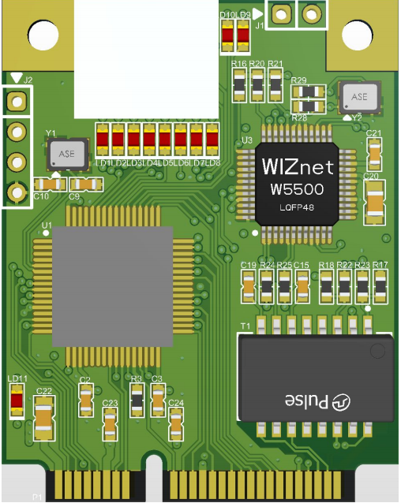
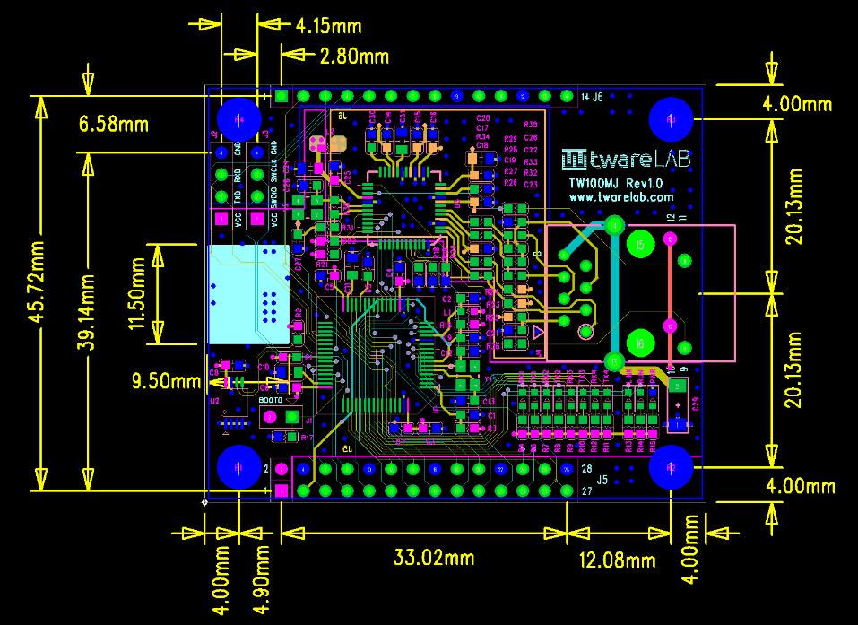
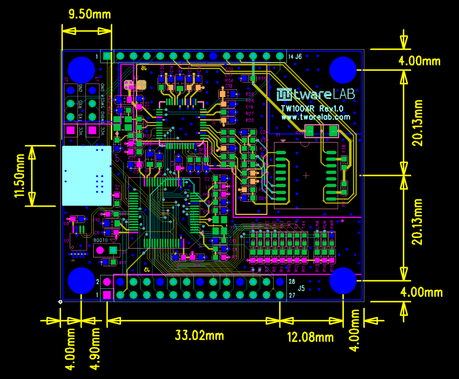
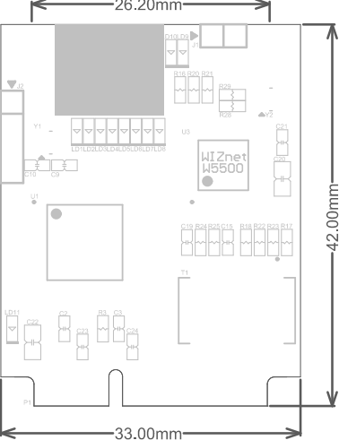
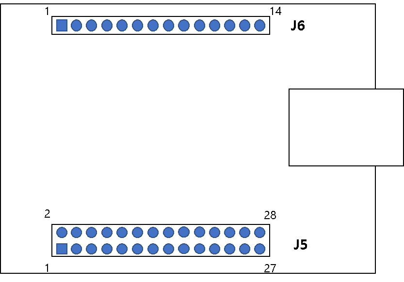
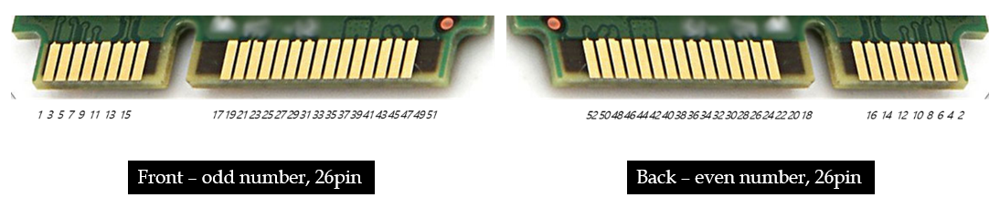
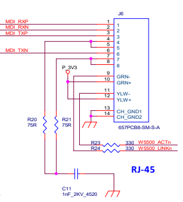

# TW100xx Datasheet

이 문서는 TW100xx 시리즈 제품의 하드웨어 정보를 제공합니다.

## Introduction
### Key Features
- 4 Port Serial
- Support DHCP IP Acquisition
- Support DNS Query
- Support NTP Time Query
- TCP/UDP Data Communication
- Support Ethernet Data Packing Options
- Support Up to *2*Mbps UART Baud Rate
### Product Specification
| Item  | Specification |
|:-----:|:---------------|
|MCU| STM32F405RGT6 (RAM: 192KByte, FLASH: 1MByte) |
|LAN| W5500 (10/100Mbps Ethernet) |
|UART| 4 Ports (3.3V TTL Level) |
|Console Port| Supported |
|Dimension| TW100MJ: 48.26(W)x61.4(H)x22.0(D), TW100XR:48.26(W)x58.0(H)x15.0(D)|
|Connector|2.54mm pitch Pin Header. J5: 2x14, J6: 1x14 |
|Input Power| DC 3.3V |
|Power Dissipation| Typical: 100mA, Peadk: 150mA |
|Temperature| Operation: 0 ~ +70 (Celius), Storage: -40 ~ +85 (Celius)
|Humidity| 10 ~ 80% |

## Hardware Specification
### Description
#### TW100MJ
- RJ45 embedded (Ethernet Transformer inside)
- 2.54 pitch pin header interface (42 pins)

#### TW100XR
- Ethernet Transformer embedded
  + RJ45 is needed on the customer board
- 2.54 pitch pin header interface (42 pins)

#### TW100PC
- Ethernet Transformer embedded
  + RJ45 is needed on the customer board
- miniPCI interface (52 pins)

### Dimension
#### TW100MJ

#### TW100XR

#### TW100PC

### Pin Map
#### TW100MJ/TW100XR
##### Header Pin Layout

##### J5 Connector
|Pins|Signal|I/O|Description|
|:---:|:---:|:---:|:--------|
|1|VCC_3.3| S | Power 3.3V |
|2|VCC_3.3| S | Power 3.3V |
|3|/RESET| I | Board Reset. Active Low |
|4|GND| S | Power Ground |
|5|UART1_RX| I | UART1 RX Pin. Input. 3.3V TTL Level |
|6|UART1_CTS| I | UART1 CTS Pin. Input. 3.3V TTL Level |
|7|UART1_TX| O | UART1 TX Pin. Output. 3.3V TTL Level |
|8|UART1_RTS| O | UART1 RTS Pin. Output. 3.3V TTL Level |
|9|STATUS_1| O | TCP Connection Status Indicator for Channel 1. *HIGH*: TCP Disconnected. *LOW*: TCP Connected |
|10|GND| S | Power 3.3V |
|11|UART2_RX| I | UART2 RX Pin. Input. 3.3V TTL Level |
|12|UART2_CTS| I | UART2 CTS Pin. Input. 3.3V TTL Level |
|13|UART2_TX| O | UART2 TX Pin. Output. 3.3V TTL Level |
|14|UART2_RTS| O | UART2 RTS Pin. Output. 3.3V TTL Level |
|15|STATUS_2| O | TCP Connection Status Indicator for Channel 2. *HIGH*: TCP Disconnected. *LOW*: TCP Connected |
|16|GND| S | Power 3.3V |
|17|UART3_RX| I | UART3 RX Pin. Input. 3.3V TTL Level |
|18|UART3_CTS| I | UART3 CTS Pin. Input. 3.3V TTL Level |
|19|UART3_TX| O | UART3 TX Pin. Output. 3.3V TTL Level |
|20|UART3_RTS| O | UART3 RTS Pin. Output. 3.3V TTL Level |
|21|STATUS_3| O | TCP Connection Status Indicator for Channel 3. *HIGH*: TCP Disconnected. *LOW*: TCP Connected |
|22|GND| S | Power 3.3V |
|23|UART4_RX| I | UART4 RX Pin. Input. 3.3V TTL Level |
|24|UART4_CTS| I | UART4 CTS Pin. Input. 3.3V TTL Level |
|25|UART4_TX| O | UART4 TX Pin. Output. 3.3V TTL Level |
|26|UART4_RTS| O | UART4 RTS Pin. Output. 3.3V TTL Level |
|27|STATUS_4| O | TCP Connection Status Indicator for Channel 4. *HIGH*: TCP Disconnected. *LOW*: TCP Connected |
|28|GND| S | Power 3.3V |
##### J6 Connector
|Pins|Signal|I/O|Description|
|:---:|:---:|:---:|:--------|

#### TW100PC
##### miniPCI Layout

##### miniPCI Connector
|Pins|Signal|I/O|Description|
|:---:|:---:|:---:|:--------|
|1|VCC_3.3| S | Power 3.3V |
|2|GND| S | Power Ground |
|3|NC|  |  |
|4|NC|  |  |
|5|NC|  |  |
|6|NRST| I | Board Reset. Active Low |
|7|UART2_CTS| I | UART2 CTS Pin. Input. 3.3V TTL Level |
|8|UART2_RTS| O | UART2 RTS Pin. Output. 3.3V TTL Level |
|9|UART2_TX| O | UART2 TX Pin. Output. 3.3V TTL Level |
|10|UART2_RX| I | UART2 RX Pin. Input. 3.3V TTL Level |
|11|VCC_3.3| S | Power 3.3V |
|12|GND| S | Power 3.3V |
|13|STATUS_1| O | TCP Connection Status Indicator for Channel 1. *HIGH*: TCP Disconnected. *LOW*: TCP Connected |
|14|STATUS_2| O | TCP Connection Status Indicator for Channel 2. *HIGH*: TCP Disconnected. *LOW*: TCP Connected |
|15|STATUS_3| O | TCP Connection Status Indicator for Channel 3. *HIGH*: TCP Disconnected. *LOW*: TCP Connected |
|16|STATUS_4| O | TCP Connection Status Indicator for Channel 4. *HIGH*: TCP Disconnected. *LOW*: TCP Connected |
|17|UART3_TX| O | UART3 TX Pin. Output. 3.3V TTL Level |
|18|UART3_RX| I | UART3 RX Pin. Input. 3.3V TTL Level |
|19|NC|  |  |
|20|UART3_CTS| I | UART3 CTS Pin. Input. 3.3V TTL Level |
|21|UART3_RTS| O | UART3 RTS Pin. Output. 3.3V TTL Level |
|22|SW_INPUT| I | SW Input for software reset. Internal Pull-Up. Active Low. |
|23|VCC_3.3| S | Power 3.3V |
|24|GND| S | Power 3.3V |
|25|Console_TX| O | Uart TX Pin for Console Messages |
|26|Console_RX| I | For Future Use |
|27|NC|  |  |
|28|NC|  |  |
|29|UART1_TX| O | UART1 TX Pin. Output. 3.3V TTL Level |
|30|UART1_RX| I | UART1 RX Pin. Input. 3.3V TTL Level |
|31|UART1_CTS| I | UART1 CTS Pin. Input. 3.3V TTL Level |
|32|UART1_RTS| O | UART1 RTS Pin. Output. 3.3V TTL Level |
|33|NC|  |  |
|34|NC|  |  |
|35|UART4_RTS| O | UART4 RTS Pin. Output. 3.3V TTL Level |
|36|UART4_TX| O | UART4 TX Pin. Output. 3.3V TTL Level |
|37|UART4_RX| I | UART4 RX Pin. Input. 3.3V TTL Level |
|38|UART4_CTS| I | UART4 CTS Pin. Input. 3.3V TTL Level |
|39|HW_TRIGGER| I |AT Command Mode Activation Pin. Active Low. Internal Pull-Up |
|40|NC|  |  |
|41|NC|  |  |
|42|NC|  |  |
|43|VCC_3.3| S | Power 3.3V |
|44|GND| S | Power 3.3V |
|45|/LINK_LED| O | Active Low. LINK LED indicator. Available for only TW100XR |
|46|/ACT_LED| O | Active Low. ACT LED indicator. Available for only TW100XR |
|47|MDI_RXN| A | Differential Signal to RJ45. Available for only TW100XR |
|48|MDI_TXN| A | Differential Signal to RJ45. Available for only TW100XR |
|49|MDI_RXP| A | Differential Signal to RJ45. Available for only TW100XR |
|50|MDI_TXP| A | Differential Signal to RJ45. Available for only TW100XR |
|51|NC|  |  |
|52|AGND| S | Analog Ground |

### Reference Schematic
