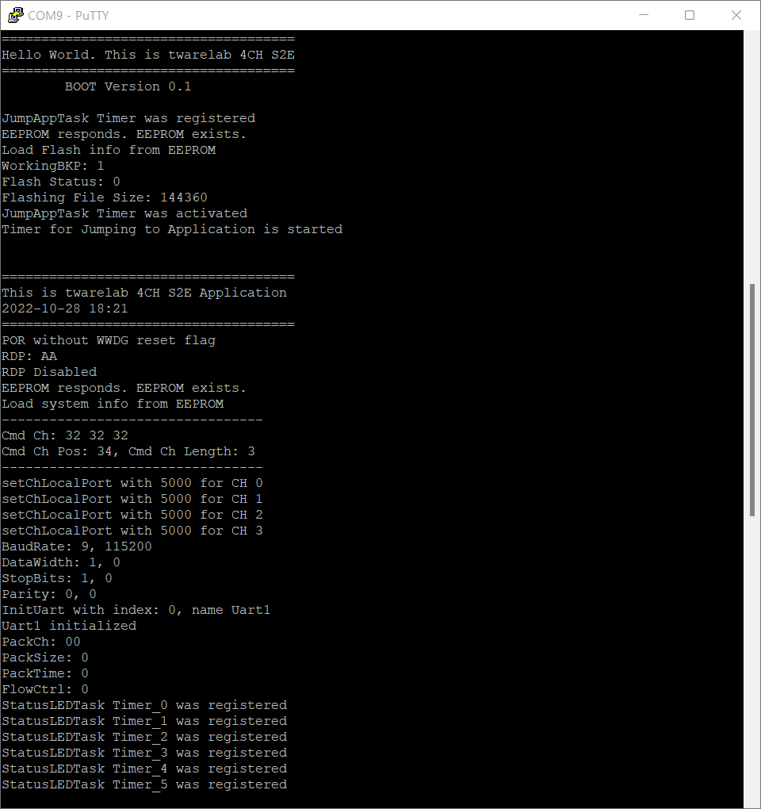
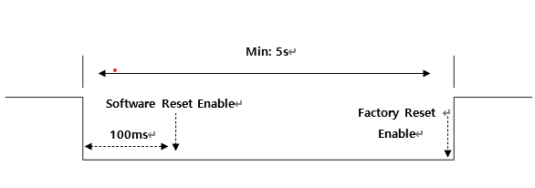
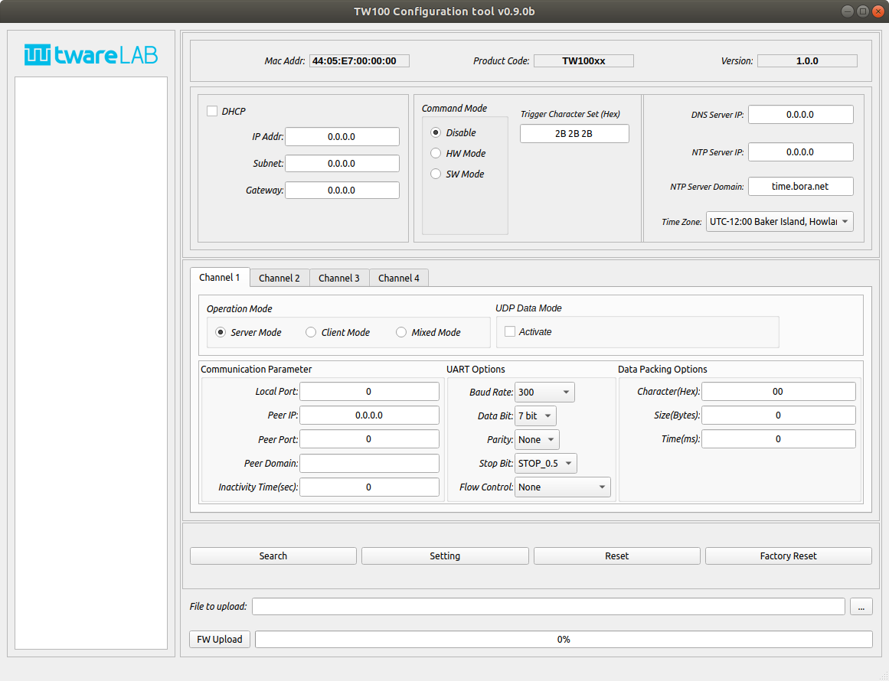
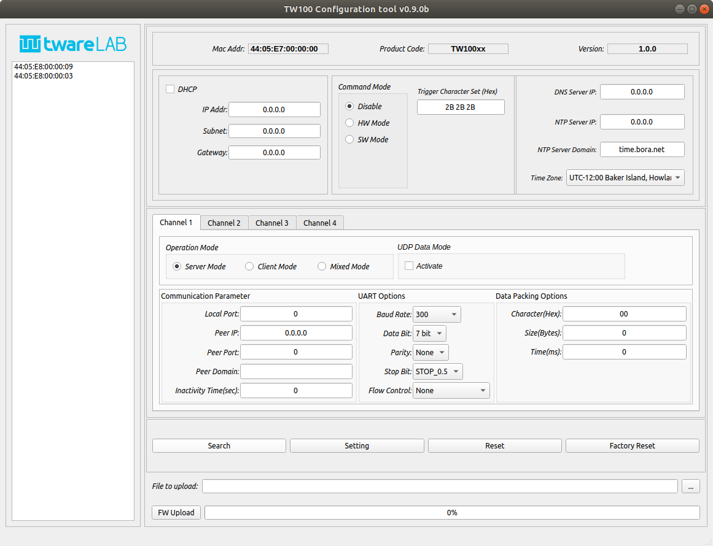
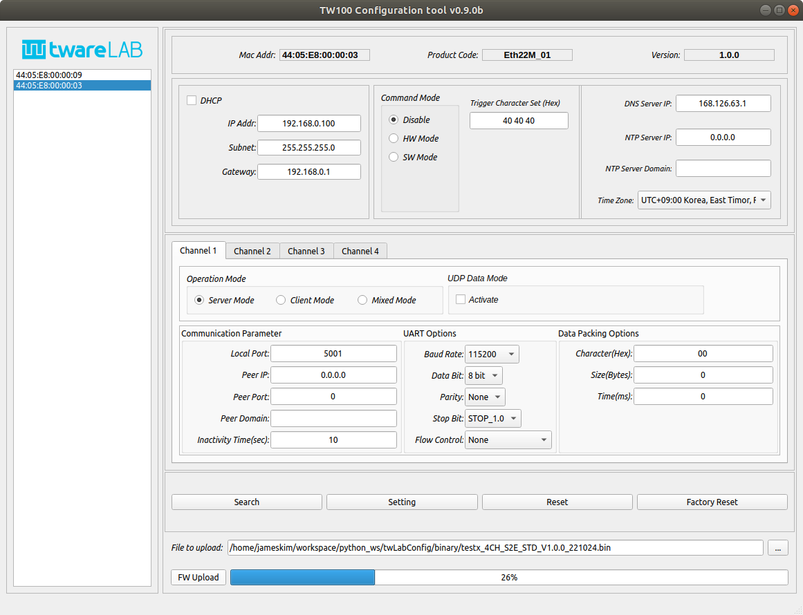
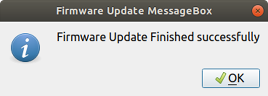

# TW100xx User Manual

이 문서는 TW100xx 시리즈 제품의 각종 기능에 대한 정보를 제공합니다.

## Introduction
### Key Features
- 4 Port Serial-to-Ethernet
- Support DHCP IP Acquisition
- Support DNS Query
- Support NTP Time Query 
- Support Time Zone Setting
- TCP/UDP Data Communication
- Ethernet Data Packing Option
- Support Up to 3Mbps UART Baud Rate
### Product Specifications
| Item  | Specification |
|:-----:|:---------------|
|MCU| STM32F405RGT6 (RAM: 192KByte, FLASH: 1MByte) |
|LAN| W5500 (10/100Mbps Ethernet) |
|UART| 4 Ports (3.3V TTL Level) |
|Console Port| Supported |
|Dimension| TW100MJ: 48.26(W)x61.4(H)x22.0(D), TW100XR:48.26(W)x58.0(H)x15.0(D)|
|Connector|2.54mm pitch Pin Header. J5: 2x14, J6: 1x14 |
|Input Power| DC 3.3V |
|Power Dissipation| Typical: 100mA, Peadk: 150mA |
|Temperature| Operation: 0 ~ +70 (Celius), Storage: -40 ~ +85 (Celius)
|Humidity| 10 ~ 80% |
## Getting Started
### Hardware Setting
TW100xx EVB를 테스트 하기위한 절차는 아래 순서를 따른다.
* EVB Box에 동봉된 USB mini Cable의 mini 단자부분을 J7 USB mini socket에 연결한다.
* USB Type A 단자를 컴퓨터에 연결한다.
* 전원 Switch(SW4)를 [ON] 부분으로 변경한다.
* LD1 LED가 점등되면 전원이 정상적으로 인가된다는 의미이다.
* Windows에서는 장치관리자를 통해서 Linux의 경우에는 ‘ls /dev’ 명령을 통해서 EVB Debug port에 연결된 Com port를 확인한다.
* PC에서 Serial Terminal Program을 실행하고 확인한 Com port를 Open한다. Baud Rate는 2Mbps이다.
* 어떤 메시지도 출력되지 않는다면 SW1 (RESET SW)를 눌러서 모듈을 하드웨어 Reset한다.
* 아래 그림과 같은 메시지가 출력되면 Hardware Setting은 정상적으로 이루어진 것이다.

#### Debug Port
| Item  | Value |
|:-----:|:---------------:|
|Baud Rate| 2Mbps |
|Data Bit| 8 bits |
|Stop Bit| 1 bit |
|Parity| None |
|Flow Ctrl| None |
### Factory Default Value
##### General Info
|    Item    | Specification |
|:-------------|:--------------|
| DHCP | Disable (Static IP) |
| Local IP Address  192.168.0.100 |
| Local Subnet | 255.255.255.0 |
| Local Gateway | 192.168.0.1 |
| DNS Server IP | 168.126.63.1 |
| HW Trigger | Enable |
| SW Input | Enable |

##### Channel Info
|    Item    | Specification |
|:-------------|:--------------|
| Mode | Server Mode |
| Connection Status | Disconnected |
| DNS | Disable |
| UDP | Disable |
| Remote IP | 0.0.0.0 |
| Local Port | 0 |
| Remote Port | 0 |
| Domain Name | NULL |
| Inactivity Time  | Disable (0) |

###### UART 
|    Item    | Specification |
|:-------------|:--------------|
| Baud Rate | 115200 |
| Data Bit | 8 |
| Stop Bit | 1 |
| Parity | None |
| Flow Ctrl | None |

###### Data Packing Option
|    Item    | Specification |
|:-------------|:--------------|
| Char | Disble (0x00) |
| Size | Disble (0) |
| Time | Disble (0) |

### Reset
모듈의 Reset에는 두 가지 방식이 있다.
MCU의 NRST 핀과 연결된 /RESET 핀을 제어하는 Hardware Reset과 MCU의 GPIO에 연결된 SW_INPUT 핀을 제어하는 Software Reset이다.
Software Reset은 SW_INPUT을 LOW로 유지하는 시간에 따라서 일반 Software Reset과 Factory Reset으로 나누어 진다.

#### Hardware Reset
MCU의 NRST 핀의 규격과 동일하다.

#### Software Reset
SW_Input 핀을 최소 100ms LOW로 유지하면 Software Reset Enable 상태로 진입하게 되고 이 상태에서 SW_Input 핀을 HIGH로 올리면 모듈은 Software Reset된다.

#### Factory Reset
SW_Input 핀을 5초 이상 연속으로 LOW로 유지하면 Factory Reset Enable 상태로 전환된다. 이후에 SW_Input 핀이 HIGH로 변환되면 모듈은 모든 옵션을 초기 설정 값으로 변경하고 Reset한다.

### Command Mode
HW_TRIGGER 핀을 제어해서 AT Command Mode를 On/Off 할 수 있다.
HW_TRIGGER 핀은 Active Low로 동작하기 때문에 HW_TRIGGER 핀을 LOW로 유지하면 AT Command를 통해서 모듈을 제어할 수 있다.
AT Command를 받아들이는 통신선은 UART1이다. HW_TRIGGER핀이 HIGH를 유지할 때 UART1은 데이터 통신용으로 사용되고 HW_TRIGGER핀이 LOW가 되면 UART1은 AT Command를 송수신하는 통로로 사용된다.
AT Command Set은 AT Commands를 참조하라.

## Configuration Tool

twareLAB Standard Configuration Tool은 twareLAB에서 공급하는 모듈을 설정하기 위해서 사용하는 PC Application이다. 
Windows용과 Linux용 두 가지 버전이 있으며 Freeware로 제공한다.
아래 그림 4는 Configuration Tool을 실행했으면 표시되는 초기 화면의 모습이다.

디바이스 검색, 설정, 리셋, Factory Reset, 펌웨어 업데이트 기능을 수행할 수 있으며, 자세한 툴의 사용법은 “TW100XX Configuration Tool Manual”을 참고하라.
아래 그림은 Device 검색 이후의 화면이다.

다음은 펌웨어 업데이트 화면이다.

정상으로 수행되면 아래와 같은 메시지 창이 뜨게 된다.

## AT Commands
HW_TRIGGER 핀 제어를 통해 AT Command 모드로 전환되면 UART1 포트로 다음과 같은 AT Command를 전송해서 각종 설정 값을 조회하거나 설정을 변경할 수 있다.
주의!) 모든 AT Command는 항상 마지막에 ‘\r\n’으로 끝나야 한다.

|    Function    | Command Syntax |
|:-------------|:--------------|
| Command Mode 확인 | AT[CR][LF] |
| 모듈 재부팅 | AT+REBOOT[CR][LF] |
| Product ID 확인 | AT+PRODUCTID?[CR][LF] |
