# TW100xx User Manual

이 문서는 TW100xx 시리즈 제품의 각종 기능에 대한 정보를 제공합니다.

## Introduction
### Key Features
- 4 Port Serial-to-Ethernet
- Support DHCP IP Acquisition
- Support DNS Query
- Support NTP Time Query 
- Support Time Zone Setting
- TCP/UDP Data Communication
- Ethernet Data Packing Option
- Support Up to 3Mbps UART Baud Rate
### Product Specifications
| Item  | Specification |
|:-----:|:---------------|
|MCU| STM32F405RGT6 (RAM: 192KByte, FLASH: 1MByte) |
|LAN| W5500 (10/100Mbps Ethernet) |
|UART| 4 Ports (3.3V TTL Level) |
|Console Port| Supported |
|Dimension| TW100MJ: 48.26(W)x61.4(H)x22.0(D), TW100XR:48.26(W)x58.0(H)x15.0(D)|
|Connector|2.54mm pitch Pin Header. J5: 2x14, J6: 1x14 |
|Input Power| DC 3.3V |
|Power Dissipation| Typical: 100mA, Peadk: 150mA |
|Temperature| Operation: 0 ~ +70 (Celius), Storage: -40 ~ +85 (Celius)
|Humidity| 10 ~ 80% |
## Getting Started
### Hardware Setting
TW100xx EVB를 테스트 하기위한 절차는 아래 순서를 따른다.
* EVB Box에 동봉된 USB mini Cable의 mini 단자부분을 J7 USB mini socket에 연결한다.
* USB Type A 단자를 컴퓨터에 연결한다.
* 전원 Switch(SW4)를 [ON] 부분으로 변경한다.
* LD1 LED가 점등되면 전원이 정상적으로 인가된다는 의미이다.
* Windows에서는 장치관리자를 통해서 Linux의 경우에는 ‘ls /dev’ 명령을 통해서 EVB Debug port에 연결된 Com port를 확인한다.
* PC에서 Serial Terminal Program을 실행하고 확인한 Com port를 Open한다. Baud Rate는 2Mbps이다.
* 어떤 메시지도 출력되지 않는다면 SW1 (RESET SW)를 눌러서 모듈을 하드웨어 Reset한다.
* 아래 그림과 같은 메시지가 출력되면 Hardware Setting은 정상적으로 이루어진 것이다.

#### Debug Port
| Item  | Value |
|:-----:|:---------------:|
|Baud Rate| 2Mbps |
|Data Bit| 8 bits |
|Stop Bit| 1 bit |
|Parity| None |
|Flow Ctrl| None |
### Factory Default Value
### General Info
| Category |      Item    | ::: | Specification |
|:--------:|:-------------|:--------------|:--------------|
| General Info| DHCP | ::: | Disable (Static IP) |
| | Local IP Address | ::: | 192.168.0.100 |
| | Local Subnet || 255.255.255.0 |
| | Local Gateway || 192.168.0.1 |
| | DNS Server IP || 168.126.63.1 |
| | HW Trigger || Enable |
| | SW Input || Enable |
|Channel Info| Mode || Server Mode |
|^| Connection Status || Disconnected |
|^| DNS || Disable |
|^| UDP || Disable |
|^| Remote IP || 0.0.0.0 |
|^| Local Port || 0 |
|^| Remote Port || 0 |
|^| Domain Name || NULL |
|^| UART | Baud Rate | 115200 |
|^| UART | Data Bit | 8 |
|^| UART | Stop Bit | 1 |
|^| UART | Parity | None |
|^| UART | Flow Ctrl | None |
|^| Data Packing Option | Char | Disble (0x00) |
|^| Data Packing Option | Size | Disble (0) |
|^| Data Packing Option | Time | Disble (0) |
|^| Inactivity Time  || Disable (0) |

### Reset
#### Hardware Reset
#### Software Reset

#### Factory Reset

## Configuration Tool

twareLAB Standard Configuration Tool은 twareLAB에서 공급하는 모듈을 설정하기 위해서 사용하는 PC Application이다. Windows용과 Linux용 두 가지 버전이 있으며 Freeware로 제공한다.
아래 그림 4는 Configuration Tool을 실행했으면 표시되는 초기 화면의 모습이다.

디바이스 검색, 설정, 리셋, Factory Reset, 펌웨어 업데이트 기능을 수행할 수 있으며, 자세한 툴의 사용법은 “TW100XX Configuration Tool Manual”을 참고하라.
아래 그림은 Device 검색 이후의 화면이다.

다음은 펌웨어 업데이트 화면이다.

정상으로 수행되면 아래와 같은 메시지 창이 뜨게 된다.

## AT Commands
### Command 모드 확인
### 모듈 재부팅
### Product ID 확인
### 펌웨어 버전 확인
### MAC 주소 확인
### 등록 상태 확인
### 등록 요청
### 네트워크 정보 요청
### 네트워크 정보 설정
### DNS 서버 주소 확인
### DNS 서버 주소 설정
### NTP 서버 주소 확인
### NTP 서버 주소 설정
### 현재 시간 확인
### Time Zone 설정
### UART 정보 확인
### UART 정보 설정
### PEER 정보 확인
### PEER 정보 설정
## Flow Control Mode
### RTS/CTS Mode
Uart의 수신 버퍼가 Full이 되면 RTS핀으로 HIGH를 출력하고 수신 버퍼가 일정 규모 이상 비워지면 RTS 핀을 LOW로 출력한다.
또, CTS 핀의 값이 HIGH 이면 Uart의 TX핀으로 데이터 전송을 멈추고, CTS 핀이 LOW이 떨어지면 Uart의 TX 핀으로 데이터 전송이 가능한 상태로 바뀐다.

### Xon/Xoff Mode
** V1.0.0에서는 지원하지 않는다. **

### RTS Only Mode
UART를 RS485 Transceiver에 연결하는 경우에 RTS 핀을 RS485 Transceiver의 TX제어 목적으로 사용한다. TX Enable이 Active LOW인 경우에 이 모드를 사용하면 된다.
RTS 신호는 TXD에 Data를 싣기 전에 LOW로 떨어지고 전송이 완료된 후에 HIGH로 전환한다.

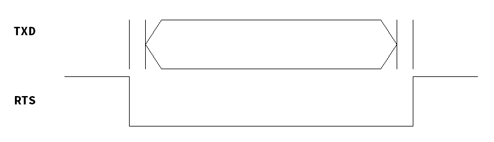
### Reverse RTS Only Mode
UART를 RS485 Transceiver에 연결하는 경우에 RTS 핀을 RS485 Transceiver의 TX제어 목적으로 사용한다. TX Enable이 Active HIGH인 경우에 이 모드를 사용하면 된다.
RTS 신호는 TXD에 Data를 싣기 전에 HIGH로 올라가고 전송이 완료된 후에 LOW로 전환한다.

** V1.0.0에서는 지원하지 않는다. **

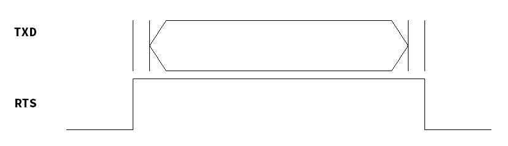
## Operation Guide
TW100XX 모듈은 시리얼 인터페이스로 송신 혹은 수신되는 데이터를 TCP/IP TCP 혹은 UDP 통신 방식으로 데이터를 전달해 주는 기능을 한다. 필수적으로 데이터 통신을 위한 TCP, UDP 설정이 필요하며, 네트워크 설정을 위해 아래와 같이 TCP Server, TCP Client, TCP Mixed mode 와 UDP 모드로 구분되어 있다. 그리고, Data packing condition 옵션을 이용하여 다양하게 전송 시점을 정할 수 있다.

### TCP Server Mode
TCP Server 모드는 시리얼 데이터 통신을 위해 TCP 연결 설정 과정에서 TW100XX 모듈이 서버로 동작하는 것을 의미하고, 지정한 Local Port로 TCP 접속시도가 오기를 기다립니다. 
연결된 TCP 연결을 통해, 시리얼 인터페이스를 통해 수신된 데이터를 송신하고, TCP 연결을 통해 수신된 데이터를 시리얼 인터페이스로 보내는 동작을 수행합니다.
따라서, TCP 서버모드 동작을 위해서는, AT Command 나 Configuration tool을 이용하여 Operation mode를 “Server Mode”로 설정하고, Local IP, Subnet, Gateway, Local Port 등의 네트워크 설정이 정상적으로 되어 있어야 합니다. 

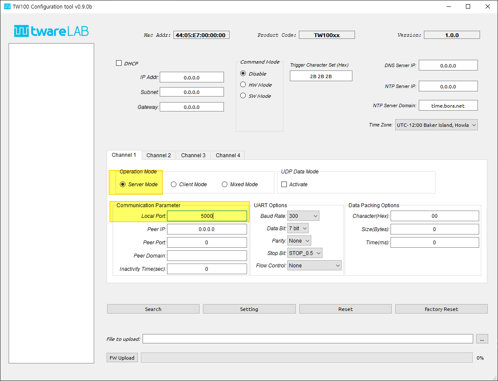

사용 예) TW100XX에 사용자가 TCP 연결을 접속한 후, 데이터를 보내면 시리얼 인터페이스로 전송되는 동작을 살펴보자. (아래 예제에 사용되는 Hercules 프로그램은 TCP/IP, UDP 터미널 기능과, serial port 터미널 기능을 전부 지원해 주어 테스트에 편리하며 다음 링크에서 다운로드 받을 수 있다. https://www.hw-group.com/software/hercules-setup-utility)
* TW100XX 보드(192.168.0.35:5000)로 접속을 시도해서, “TEST_DATA_FROM_ETHERNET” 데이터를 보낸다.

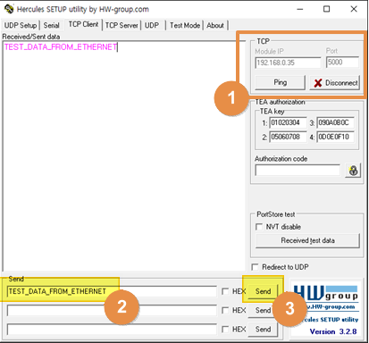

* TW100XX 보드의 시리얼 인터페이스 (COM10, 115250bps)의 터미널을 통해 “TEST_DATA_FROM_ETHERNET” 데이터가 정상적으로 수신되었는지 확인할 수 있다.

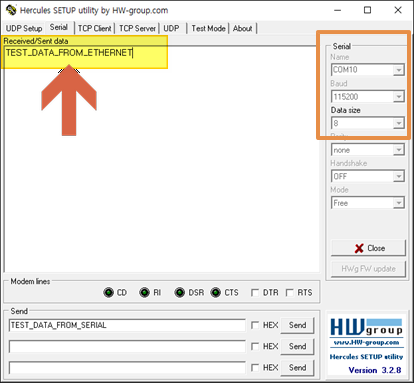

### TCP Client Mode

연결된 TCP 연결을 통해, 데이터를 송신, 수신하는 방식은 동일하다. 단, 서버 모드와 다르게 Client 모드는 TX100XX 모듈이 TCP접속을 시도하도록 되어 있다.
즉, AT Command 혹은 아래 그림과 같이 Configuration tool을 통해 “Peer IP”, “Peer Port”에 접속할 정보를 지정하고, Operation mode를 Client mode 로 설정하면 자동으로 TCP 접속시도를 하게 된다. 

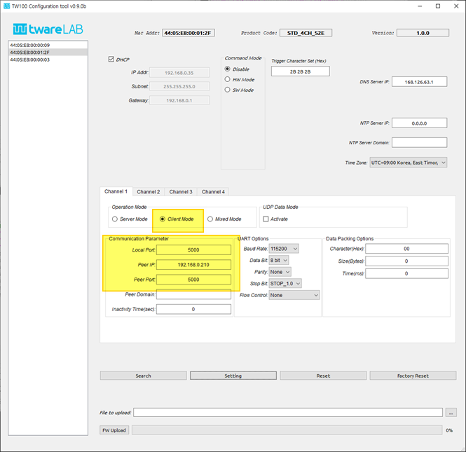

TCP 연결이 정상적으로 되면, 연결된 TCP 연결을 통해, 시리얼 인터페이스를 통해 수신된 데이터를 송신하고, TCP 연결을 통해 수신된 데이터를 시리얼 인터페이스로 보내는 동작을 수행합니다.

### TCP Mixed Mode

TCP 연결하는 방식인 Server, Client 모드를 함께 쓰는 방식이다. 보드 리셋 이후에는 TCP Server mode 로 동작하고 TCP 연결 시도를 기다리고 있다. 즉, TCP 서버 모드와 완전 동일하게 동작한다. 단, 만약 TCP 연결이 없을 때 시리얼 데이터가 수신되면, 서버 모드처럼 기다리지 않고 Client mode 로 변경되어 “Peer IP”, “Peer Port”에 지정된 곳으로 TCP 접속을 시도하고 바로 데이터를 보내는 것을 지원한다.
따라서, Mixed mode를 사용하는 경우, 아래 그림과 같이 “Operation Mode”와 “Local Port”, “Peer IP”, “Peer Port”값 전부를 설정해 줘야 한다.

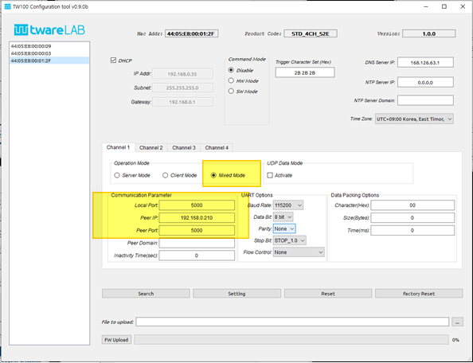

### UDP Mode

UDP 모드는 시리얼 데이터를 TCP 가 아닌 UDP 통신 방식을 통해 보내는 모드이다.
설정은 아래 그림과 같이, TCP Mixed mode와 유사하다. 단, UDP Data Mode를 “Activate” 시켜줘야 한다. 

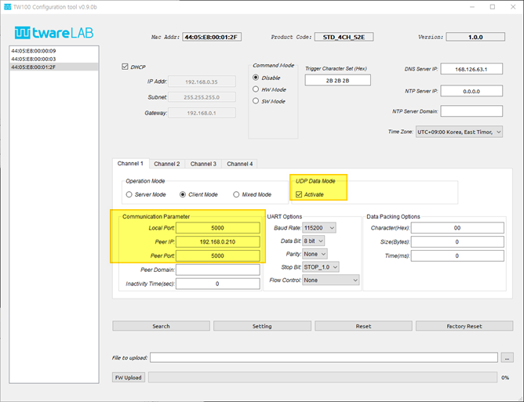

사용 예) TW100XX에 사용자가 UDP mode를 활성화하고, 시리얼 데이터를 보내면 UDP로 전송되는 동작을 살펴보자
* TW100XX에 연결된 시리얼 인터페이스로 데이터를 보낸다.

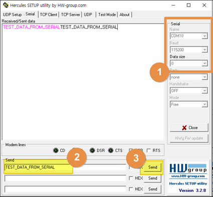

* 아래 그림처럼, 네트워크 터미널을 통해 UDP로 정상적으로 데이터가 수신되는 것을 볼 수 있다.

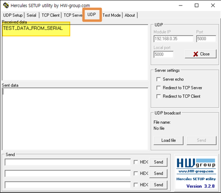

### Data Packing Option
시리얼 데이터를 TCP/IP 네트워크로 전송할 때, 시리얼에서 수신한 데이터를 실시간으로 바로 보내는 것이 기본적인 방식이지만, 특정한 조건을 만족할 때까지 데이터를 모았다가 한꺼번에 TCP/IP 네트워크로 데이터를 보내고 싶은 경우 사용하는 기능이며, 아래와 같이 3가지 조건을 지원한다. 만약, 2가지 이상의 조건이 설정되는 경우, 하나의 조건만 만족되면 바로 데이터가 전송된다.

* Character (Hex code) – 지정된 특정 Character가 들어올 때까지 시리얼 버퍼 데이터를 모았다가 한번에 Ethernet 패킷을 만들어서 전송합니다. Configuration tool 에서는 hex code 값으로 지정이 가능하다. 예를 들어 Carriage return(CR)을 설정하고 싶다면 그것에 해당하는 ascii code의 hex code 값인 “0d”를 입력하면 된다. 값이 “00”이면, 이 조건을 비활성화한다.
* Size (0 ~ 1000 bytes) - 시리얼 버퍼에 일정한 길이의 데이터가 저장될 때까지 기다렸다가 해당 길이의 데이터 바이트수가 모이면 한번에 Ethernet 패킷으로 만들어서 전송한다. 값이 “0” 이면, 이 조건을 비활성화한다.
* Time (0 ~ 65535 ms) - 지정된 시간(millisecond 단위)이 되면 데이터를 Ethernet 패킷으로 만들어서 전송한다. 값이 “0” 이면, 이 조건을 비활성화한다.

사용 예) TW100XX에 사용자가 “Data Packing Condition” 부분의 “Character” 부분을 활성화한 경우의 동작을 살펴보자.

- “Data Packing Option” 부분의 “Character” 부분에 0x0A 값을 설정한다.

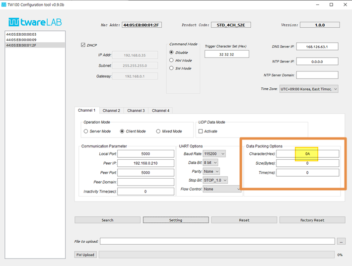

- 아래와 같이 TW100XX에 연결된 시리얼 인터페이스로 0x0A가 포함된 데이터를 보낸다. 
  “1234567” + 0x0A

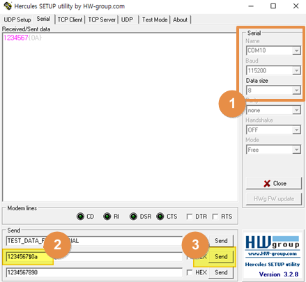

- TCP로 연결된 PC에서 정상적으로 “1234567”+0x0A 값이 한번에 들어오는 것을 확인할 수 있다. (만약, Data Packing Option이 설정되지 않았다면, 한번에 들어오지 않고 몇 개의 데이터 패킷으로 나누어서 수신된다.)

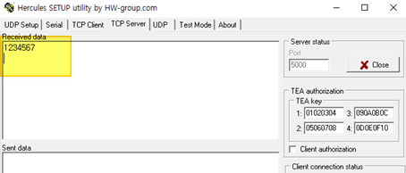

#### Data Packing Option 순서
Data Packing Option은 세가지 조건을 혼용해서 사용할 수 있다. 이때 조건을 따지는 순서는 Character -> Size -> Time 이다.
## Evaluation Board
### Hardware Specification
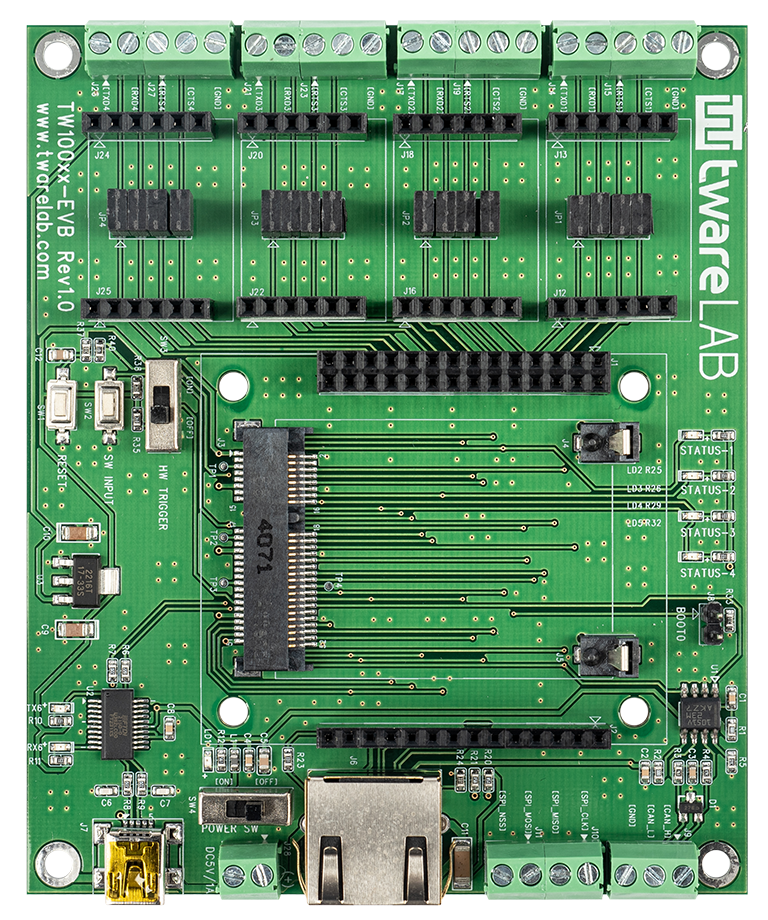

TW100xx-EVB는 크게 6개 블록으로 나누어 진다. 
시리얼 단자 블록, CAN/SPI 단자 블록, 전원 블록, 외부 스위치 입력 블록, 모듈 장착 블록, Ethernet 연결 LED 블록이 그것으로 각각의 구성은 아래 절에서 설명한다.

#### Serail Terminal Block
시리얼 단자 블록은 외부에서 각각의 데이터 통신용 시리얼 포트와 연결하기 위한 단자 블록이다. 기본적으로 시리얼 단자는 TW100xx 모듈의 UART Port가 3.3V TTL level로 연결되어 있다.
RXD/TXD/RTS/CTS 4개 핀이 연결되어 있다.

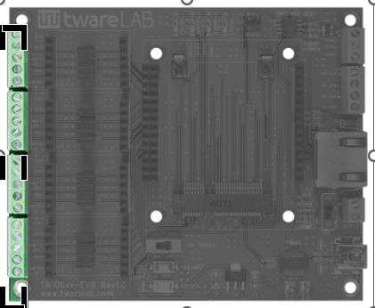

##### 신호 레벨 변환
각 단자 내부에 있는 Header Socket에 Serial Converter Modules를 장착해서 RS232/RS485/RS422 신호 레벨로 전환할 수 있다.
Serial Converter Modules 모듈을 장착해서 신호 레벨을 변환하기 위해서는 각 Header Socket 사이에 있는 Shunter를 제거하고 적합한 Protocol Converter 모듈을 헤더 소켓에 장착한다.
아래 표는 Serial Converter Modules 모듈 사용 유무에 따라 각 핀이 어떤 신호를 나타내는 지를 표시한다.

#### CAN & SPI Terminal Block

CAN 및 SPI 터미널 단자는 CAN 통신이나 SPI 통신을 위한 신호선을 연결하기 위한 단자로 추후 지원 예정이다.

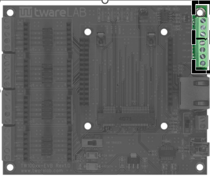

#### Power Input Block

전원 입력 블록은 외부 전원을 연결하기 위한 단자와 전원 ON/OFF 스위치가 포함되어 있다. 외부 전원 입력은 5V 전원을 직접 연결하거나 USB 단자를 통해서 PC에서 5V를 공급할 수 있다.

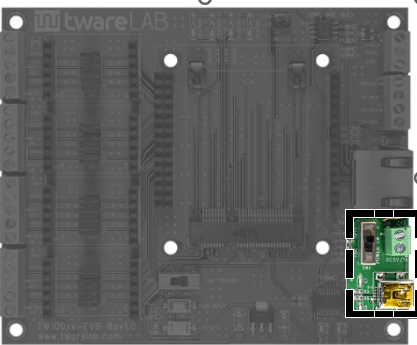

#### Reset & Switch Block

이 블록은 모듈을 Hardware Reset시키기 위한 Push Switch(SW1)과 외부 옵션 입력을 위한 Push Switch(SW2), Slide Switch(SW3)로 구성된다.

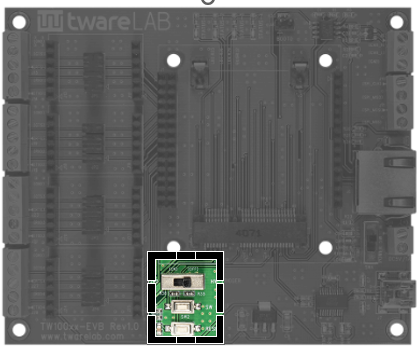

#### S2E Module Socket Block

이 블록은 TW100MJ/XR/PC 중 하나를 장착하기 위한 위치이다.

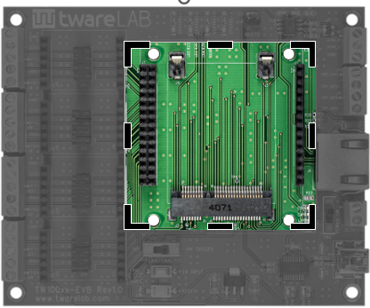

#### Status LED Block

이 블록은 각 설정된 소켓에 TCP 연결이 되었는지 여부를 LED를 통해서 나타내는 부분이다.
TCP 연결이 되면 해당 LED가 ON되고 연결이 끊어지면 LED가 OFF된다.

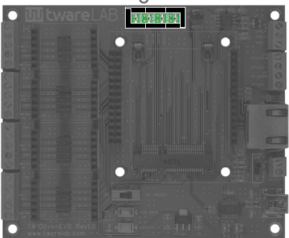

### TW100MJ Example

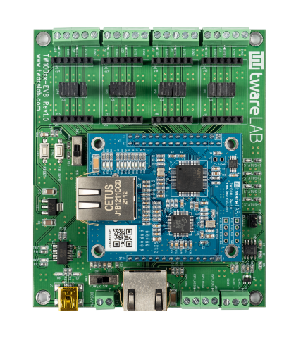

### TW100XR Example

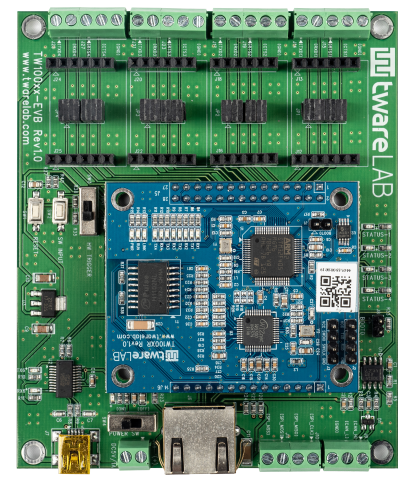

### TW100PC Example

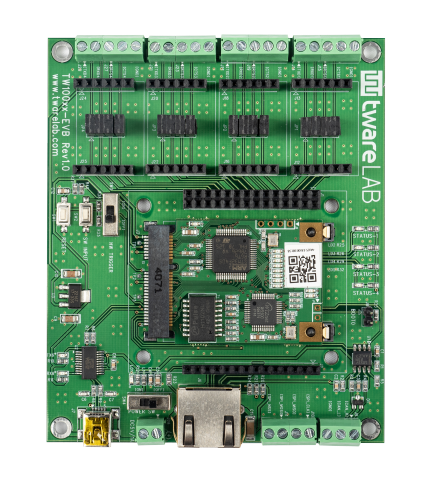

### Serial Converter Modules
#### TTL-to-232 Module

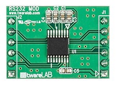

#### TTL-to-485 Module

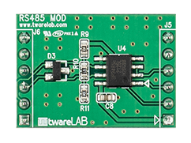

#### TTL-to-422 Module

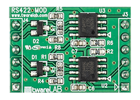

#### Converter Module 연결 예제

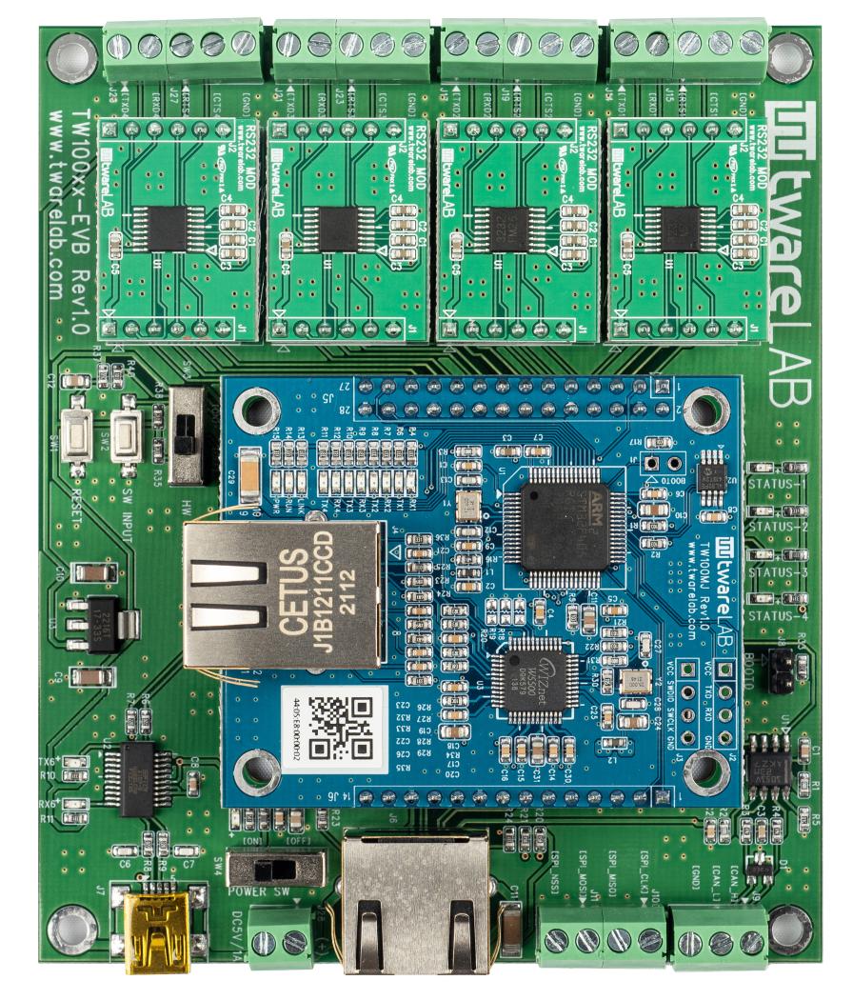

