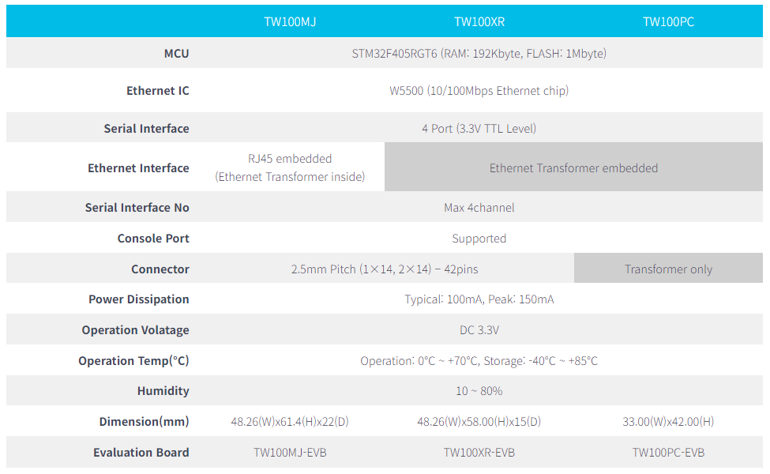

# TW100 Series

티웨어랩의 TW100 Series는 프로토콜 변환기 역할을 하는 임베디드 모듈입니다.
시리얼 장비가 보낸 데이터를 TCP/IP 데이터로 변환시켜 네트워크로 전송시키는 역할과 네트워크를 통해 받은 TCP/IP 데이터를 시리얼 데이터로 전환시킨 후 전송하는 역할을 합니다.

:::caution
주의 창입니다. 문법 공부 필수
:::

## 제품 사양

## Main features

- Support 4 serial ports simultaneously
- Easy to connect to TCP/IP Internet network
  - Add a Internet fucntions into legacy serial device
  - Support firmware customizing
- High stable and reliability with full hardware Ethernet chipset
- Easy config with Configuration Tool Program
- Supports “Serial Command” set for Serial Configration
- Supports Static IP, DHCP setting
- Includes DNS function

## Documents
- [TW100XX Datasheet – V1.1](img/TW100xx-Datasheet-Rev1.1.pdf)
- TW100XX User Manual – V1.0(한국어, English version)
- TW100XX Configuration Tool Manual – V1.0(한국어, English version)

## Download

### Configuration Tool

V1.1.7d (2023.12.21) – Fix “Socket port binding” Error

Windows version – Download
Linux version – Download
V1.1.6d

Windows version – Download
V1.1.4d

Windows version – Download
V1.1.2d

Windows version – Download
Linux version – Download
